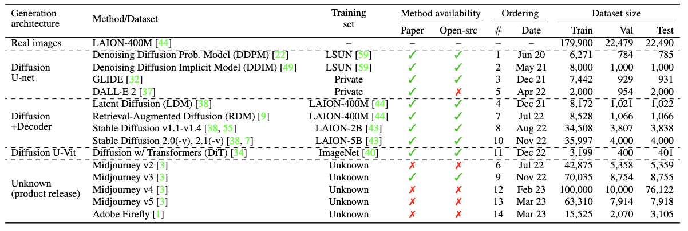
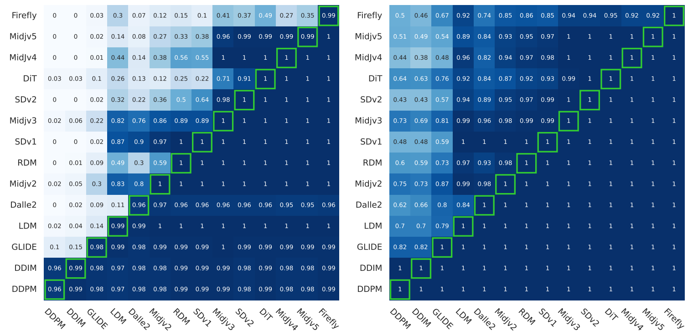
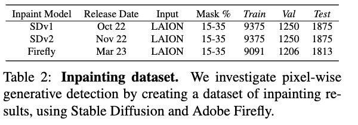
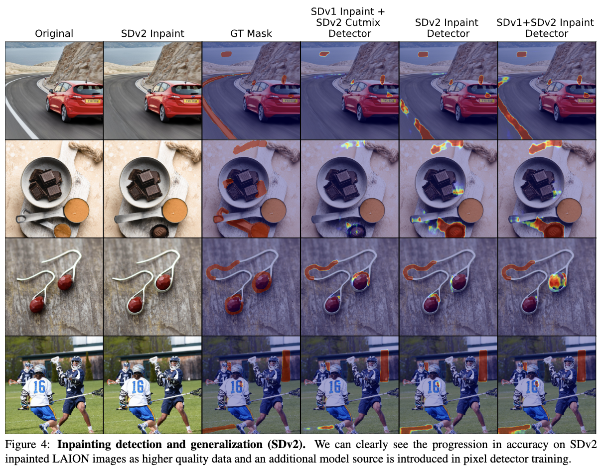
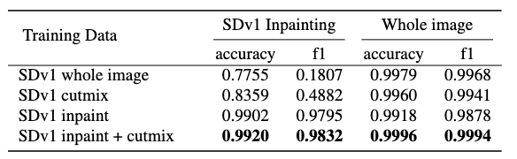
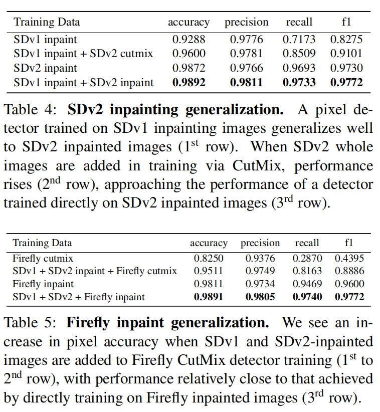

# Online Detection of AI-Generated Images

**作者：** David C. Epstein, Ishan Jain, Oliver Wang, Richard Zhang  
**机构：** Adobe Inc.  
**发表时间：** 2023年10月

# Online Detection

## 核心问题

AI 图像生成模型不断涌现，是否可以训练一个检测器，让它不只能识别"已知"的生成模型，还能泛化到未来还没见过的新模型？

模型泛化：

> GAN_1生成图片 -> 训练模型M -> 检测GAN_2生成图片

> GAN_1生成图片 -> 训练模型M -> 检测diffusion生成图片

---

## 技术细节
### 主要方法

收集了 14 个主流生成模型（DDPM → Midjourney v5 → Firefly），按**历史发布时间顺序**逐步训练 CNN 分类器，模拟真实世界的"在线学习"场景，共 57 万张图片。

### 模型训练
- **需求** Binary classifier with corss-entropy loss
- **检测骨干网络：** CNN: ResNet-50（预训练于 ImageNet）
- **训练策略：** 按模型发布时间，逐个送入CNN训练，并用检测分类结果

### 数据集

## 实验结果

- 直接训练生成器能检测成功吗？
可以，对角线几乎100%

- 一个检测器能同时检测多个“见过的”生成器吗？
可以，右下三角区域性能很好

- 检测器能泛化到“未见过的”生成器吗？
观察左上角区域

- “训练N个模型 → 测试第N+1个”的性能

作者观察到，某些模型加入训练后，对其他模型的检测性能有显著提升（反映在AuC热力图中的“跃升”）。当某一新架构的模型加入训练集，对其他同类型的模型生成图片的检测性能显著提升。

作者结论：泛化是存在的，但不是无限的。随着新模型不断出现，在线训练（持续加入新数据）仍然是必要的。

# 像素级检测(Inpainting)
真实图片+AI生成内容。

> Real image + a masked region of an image is seamlessly filled with generated content.

## 技术细节
### 训练细节
- 模型选用: Fully Covolutional Network (FCN) with ResNet-50 architecture.
- 损失函数: weighted Dice loss

- 开源模型 -> 直接获得掩码

- 闭源模型 -> CutMix手动拼接真实图像与生成图像 -> 获得像素区域

- 开源模型 -> 直接获得掩码 + CutMix -> 能否获得更好效果？

### 数据集

数据生成过程：
> We sample input images and corresponding prompts from the LAION-400M Dataset[44].
We resize images to 512 pixels on the short side and cen-
ter crop and generate a mask. We create masks covering 15
to 35% of each image, with random overlapping strokes and
shapes. In order to preserve the fidelity of the non-masked
region and isolate the generated pixels from the original,
we copy the original image back into the non-masked re-
gion. Importantly, we do not observe this approach to cause
a visible seam.

INPUT: 真实+部分AI生成图像，AI生成的区域掩码 

### 实验结果

f1: 调和平均数(precicion, recall)

- 我们能否创建像素检测器？
可以，table3的最后一行

- 可以用像素检测器检测全图吗？
可以，table3显示在Whole image情况也表现也很好

- 像素检测器的跨模型泛化能力如何？

作者没有给出仅用SDv1, SDv2训练，检测Firely生成的结果。猜测效果不好。

## 局限性
- 未覆盖所有模型（如 Imagen、Parti、GigaGAN）
- 只用了简单架构，更强架构可能效果更好
- 架构差异大的新模型泛化仍然困难

---

## 给我的启发
- 一般的检测用简单模型（CNN）就有不错的效果
- 主要需要解决的是架构差异较大的模型的模型间泛化能力
- 如何对最新的，闭源商业模型进行检测？

> 用旧模型提升泛化能力 or 用新模型，但需要一些数据处理的手段