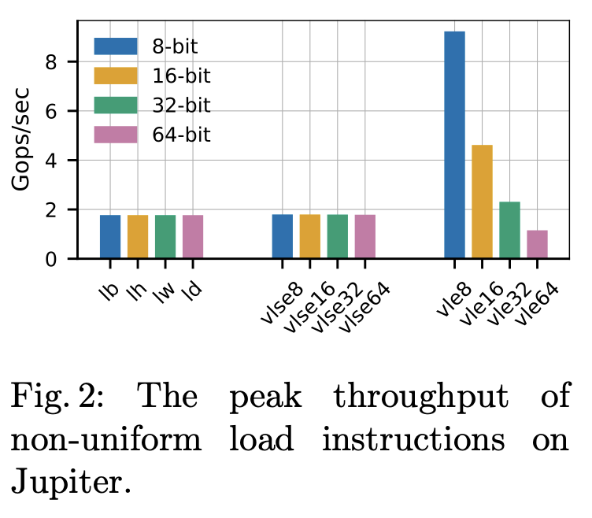
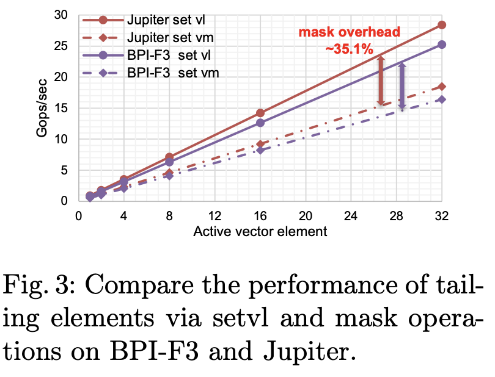
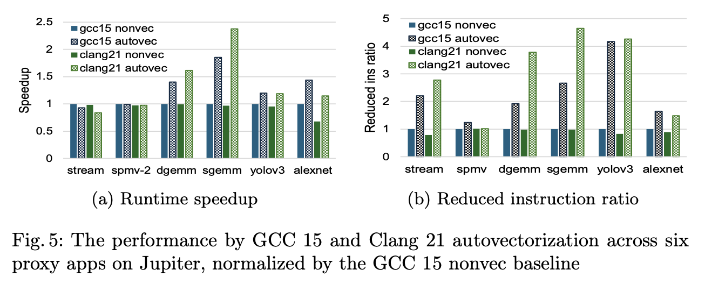
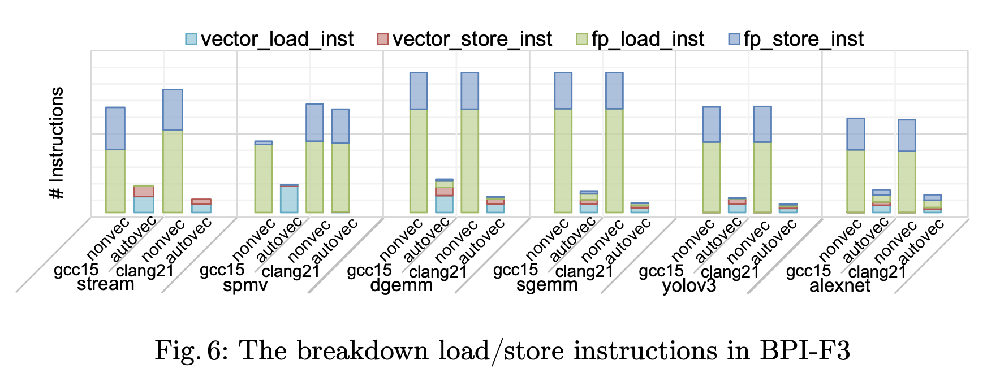
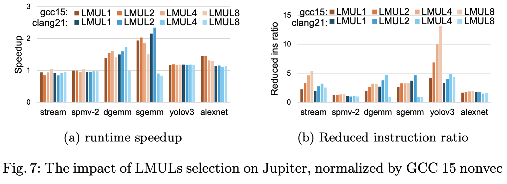
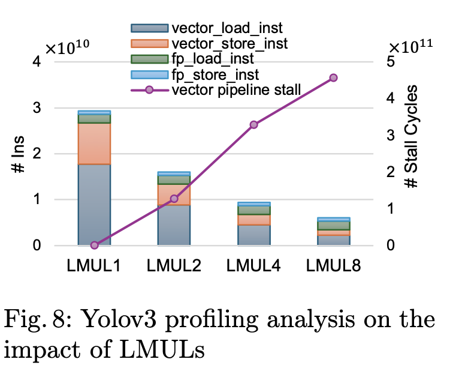
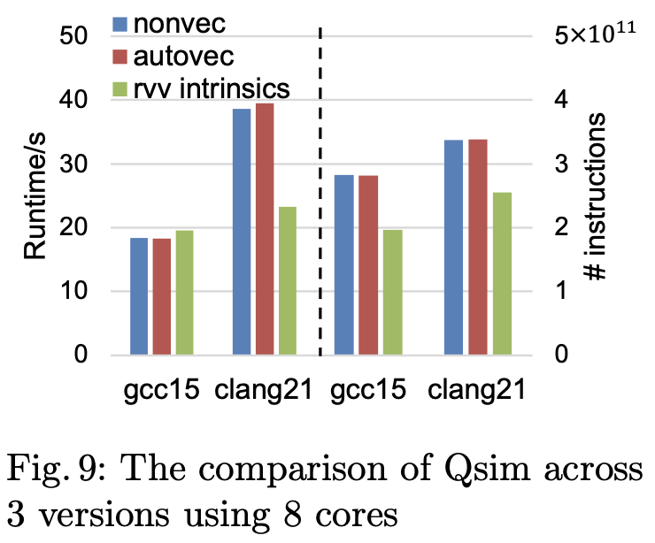

# Note

## Abstract

> The RISC-V Vector Extension (RVV) is a cornerstone for
supporting compute throughout in scientific and machine learning work-
loads. **Yet compiler support and performance monitoring on real RVV1.0
hardware are still evolving**. In this work, we design a suite of assembly
microbenchmarks to establish performance ceilings and calibrate performance counters on RVV hardware. Leveraging the assembly benchmarks, we find that **predication overhead and stride load pose performance challenges that current compiler cost models do not yet fully address**. Moreover, we present the first evaluation of GCC 15 and LLVM 21
autovectorization in HPC and ML proxy applications. GCC 15 outper-
forms LLVM 21 in four out of six applications. LLVM 21 only outper-
forms GCC 15 in SGEMM and DGEMM, driven by more aggressive
instruction reduction confirmed through validated perf counters on the
RVV hardware. **We further show that the default LMUL selection in compilers performs close to the optimal**. To study the RVV support for
product-level application, we also evaluate the state-vector quantum simulator, Google’s Qsim, with both manual RVV intrinsics and compiler
auto-vectorization, revealing **immaturity in current RVV compiler for complicated memory access pattern**.

What they have done:

1. Design assembly microbenchmarks
2. Evaluate performance of GCC and LLVM in autovectorization in HPC and ML applications
3. Compare manual RVV instrinsics and compiler auto-vectorization on Google's Qsim

What they have found:

1. Current compiler cost models do not yet fully address predication overhead and stride load performance challenges.
2. Impact of LMUL selection.
3. Current RVV compilers are not doing well in complicated memory access pattern.

## 4 Understanding Basic RVV Instructions

### Segment load v.s. Unit Load + mask

1. The results show vlse and scalar are consistent at 1.78 Gops/s in any variants.

2. vle with mask achieves the best performance of 9.2 Gops/s at 8-bit precision and the throughput scales up with reduced data precision. In 64-bit data precision, the throughput of the vle with mask is 0.65× lower than vlse.

### vsetvl v.s. mask

> The first benchmark uses the vset{i}vl{i} instruction to change the VL. The second benchmark achieves the same goal by setting the mask register v0.t.

1. The first benchmark outperforms the second one.

2. the observed overhead mainly comes from vector execution, representing the inefficiency in executing the masked vector instructions in vector units.

## 5 GCC15 and Clang21 Support in Proxy Apps

### Experiment Set Up
> While the assembly benchmark helps understand performance ceiling, evaluating proxy applications from scientific and ML workloads is necessary to assess
whetherautovectorizationtranslatesintoapplicationlevelspeedups.Weevaluate
six proxy applications compiled with GCC 15 and Clang 21 into non-vectorized
and autovectorized binaries. We report all speedups normalized against the non-
vectorized GCC 15 baseline. We evaluate performance on both BPI-F3 and
Jupiter and observe consistent conclusions across the two platforms. Therefore,
unless otherwise stated, the following results presented are from Jupiter.

- Compilers: GCC 15 v.s. Clang 21
- Applications: stream, spmv-2, dgemm, sgemm, yolov3, alexnet.
- Hardware: Jupiter, BPI-F3 (both SpacemiT K1)

### Experiment Result

- The autovectorization benefits are highly application-dependent.
- Clang 21 better in dgemm and sgemm, probably because of its SpacemiT X60
specific instruction scheduling model and LMUL selection. 
- GCC 15 better in yolov3 and alexnet.
- Stream and SpMV, two memory-bound benchmarks, show no autovectorization benefit from both compilers. Sometime even worse!

> SpMV shows nearly no instruction reduction under either compiler in RVV.
Forcomparison,we evaluate the same kernel on another VLA architecture,ARM
SVE,where a 1.99× instruction reduction by GCC auto-vectorization is observed
on a 128-bit SVE Neoverse V2 core. This discrepancy suggests that the automatic vectorization support for RVV remains less mature and requires further improvements in the compiler toolchains.

> Comparing the two compilers, Clang 21 consistently reduces more instructions than GCC 15 across all vectorized applications, but this advantage is most effectively converted into speedup when the application is compute-bound. For memory-bound workloads, the instruction savings go largely unrealized as the LPDDR4X channel memory subsystem becomes the bottleneck.

- A 1.99× instruction reduction by GCC auto-vectorization is observed on a 128-bit SVE Neoverse V2 core, which suggest a more mature auto-vectorization support.

- Instructions reduce ratio is more effectively converted into sppedup when the application is compute-bound.

### Profiling Analysis

> However, although Clang 21 achieves a larger instruction reduction for STREAM, the observed performance
is worse, likely caused by unsuitable memory access order after vectorization. As an in-order CPU model, the performance of Spacemit(R) X60 is sensitive to the static instruction scheduling by compilers. 

- For stream, low performance gain is likely caused by unsuitable memory access order after vectorization

> SpMV is the notable exception: both non-vectorized and autovectorized versions retain a similar instruction mix with a dominant FP load component and negligible vector memory instructions in Clang 21. Although vector load dominates in GCC 15 and obviously reduces the FP ld/st instructions, the total instructions are almost not reduced according to Figure 5b. Further analyzing the compiler vectorized report, for the indexing memory access vector[colIndex[col]], Clang 21 can not identify array bounds in SPMV, avoiding any parallelization optimization techniques. GCC 15 can vectorize part of the code using variable-length unit vector load, but additional missed optimizations associated with statement clobbers memory,avoiding further vectorization in fused-multiply-add.

- For SpMV neither Clang 21 nor GCC 15 succefully generate auto-verized instructions.

### Impact of LMUL in GCC15 and Clang21.

> For most applications, selecting LMUL=1 or
LMUL=2 provides better performance. Larger LMUL values increase register pressure and may trigger register spilling, which significantly degrades performance. This observation suggests that the compiler’s default LMUL selection strategy is close to the optimal, and tuning the larger LMUL in GCC 15 can get more performance gains than Clang 21.

> However, despite the reduction in total instruction and ld/st instructions, no speedup benefit is observed. To investigate the bottleneck, we profile the vector pipeline behavior. Figure 8 reflects that the vector store pipeline cycles increase linearly with larger LMUL, rising from 2.3 × 108 at LMUL1 to
4.6 × 1011 at LMUL8. This indicates that aggressive vector register grouping increases pressure on the vector pipeline, eventually exceeding its peak throughput. Consequently, instructions must wait for available vector pipeline resources to execute and commit, resulting in pipeline stalls.

- Overhead introduced by vector pipeline stall?

## 6 Real Application

- Autovec doesn't happen
- Intrinsics reduce number of instructions
- No performance gain

> Qsim results highlight the limitations of current compiler auto-vectorization for applications with complex memory access patternsas Qsim.GCC 15 performs better than Clang 21 in this real-world workload. Manual RVV intrinsics can effectively reduce instruction counts, but the achieved performance is strongly dependent on compiler code generation quality,
requiring further optimization and compiler support for VLA architectures.