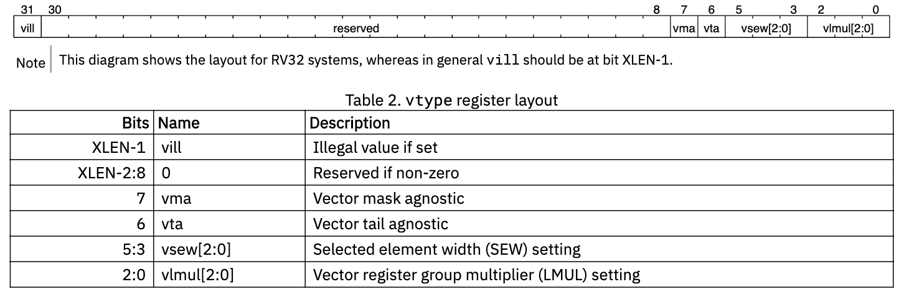

# RISC-V V Extension
## 1. Introduction

## 2. Implementation-defined Constant Parameters.
`Implementation-defined`: For microarchitecture implement RVV need to support these parameters.

`ELEN`: Element length. Width of an element in the vector.

`VLEN`: Vector length. Width of the vector register.

> VLEN <= 2^16

## 3. Vector Extension Programmer's Model
> The vector extension adds 32 vector registers, and seven unprivileged CSRs (`vstart`, `vxsat`, `vxrm`, `vcsr`, `vtype`, `vl`,
`vlenb`) to a base scalar RISC-V ISA.

`CSR`: Control and Status Register. 控制 CPU 行为、以及反映 CPU 当前状态的特殊寄存器。

These CSRs are "unprivileged", which means they are accessable in user mode.

### 3.1 Vector Registers
> The vector extension adds 32 architectural vector registers, v0-v31 to the base scalar RISC-V ISA. Each vector register has a fixed VLEN bits of state.

Vector Registers的长度是硬件固定的，可以改变的是VL（当前向量长度，用于部分寄存器操作）

### 3.2 Vector Context Status in `mstatus`
> A vector context status eld, VS, is added to `mstatus[10:9]` and shadowed in `sstatus[10:9]`. It is dened analogously to the floating-point context status field, `FS`.

`mstatus`, 是 Machine Status Register（M-mode 状态寄存器）

> Attempts to execute any vector instruction, or to access the vector CSRs, raise an illegal-instruction exception when
mstatus.VS is set to Off.

When `VS` is set to `off`, which means that doesn't "want" to support vector instruction set.

> When mstatus.VS is set to Initial or Clean, executing any instruction that changes vector state, including the vector CSRs, will change mstatus.VS to Dirty. Implementations may also change mstatus.VS from Initial or Clean to Dirty at any time, even when there is no change in vector state.

`mstatus.VS` 是一个 hint-like 的状态位，用于 OS 优化上下文切换。
硬件 必须在向量状态被修改时将 VS 设为 Dirty，但允许在任何时候保守地把 VS 设为 Dirty，即使实际状态没有变化，以简化实现并保证正确性。

> If `mstatus.VS` is Dirty, `mstatus.SD` is 1; otherwise, `mstatus.SD` is set in accordance with existing specications.

`mastatus.SD`: State Dirty(SD). If one of the FS, VS, XS(Other extensions' state) becomes one, SD will set to be one (dirty).

> Implementations may have a writable misa.V field. Analogous to the way in which the floating-point unit is handled, the
mstatus.VS field may exist even if misa.V is clear.

`misa.V`: Machien ISA registers, V field stands for whether the current ISA supports vector extendion. This is writable, means that OS or Hypervisor could turn on/off.

> Note: Allowing mstatus.VS to exist when misa.V is clear, enables vector emulation and simplfies handling of mstatus.VS in systems with writable misa.V

### 3.3 Vector Context Status in `vsstatus`
This part's design is used for virtualization. With the hypervisor extension, vector context status is maintained at both guest (`vsstatus.VS`) and host (`mstatus.VS`) levels. Vector execution is permitted only when both fields are non-Off. Any modification to vector state marks both contexts Dirty, allowing independent tracking of extended state for guest and host context switching. This design mirrors the floating-point virtualization model and supports vector emulation even when misa.V is clear.

### 3.4 Vector type register, vtype
> The read-only XLEN-wide vector type CSR, `vtype` provides the default type used to interpret the contents of the vector
register file, and can only be updated by `vset{i}vl{i}` instructions. The vector type determines the organization of
elements in each vector register, and how multiple vector registers are grouped. The `vtype` register also indicates how
masked-off elements and elements past the current vector length in a vector result are handled.

`XLEN-wide`: RV-32,X = 32. RV-64, x = 64.

`vtype`提供了vector register file 中数据的结构信息

#### 3.4.1 Vector selected element width vsew[2:0]
> The value in `vsew` sets the dynamic selected element width (SEW). By default, a vector register is viewed as being divided into VLEN/SEW elements.

#### 3.4.2 Vector Register Grouping(`vlmul[2:0]`)
> but the main reason for their inclusion is to allow double-width or larger elements to be operated on with the same vector length as single-width elements.

> Note: The vector architecture includes instructions that take multiple source and destination vector operands with different element widths,but the same number of elements. 

e.g. `vadd.vv vd, vs1, vs2`

> The effective LMUL (EMUL) of each vector operand is determined by the number of registers
required to hold the elements. For example, for a widening add operation, such as add 32-bit values to produce 64-bit results, a double-width result requires twice the LMUL of the single-width inputs.

> For a given supported fractional LMUL setting, implementations must support SEW settings between SEWMIN and LMUL * ELEN, inclusive.

`SEWMAX = LMUL_fraction * ELEN`
SEWMAX: 最大可选元素长度
ELEN: 硬件最大支持元素长度

> The use of vtype encodings with LMUL < SEWMIN/ELEN is reserved, but implementations can set vill if they do not support these congurations.

理论上可以支持 SEWMIN > LMUL * ELEN, 但是这样不会充分使用vector regster

#### 3.4.3. Vector Tail Agnostic and Vector Mask Agnostic vta and vma

`Tail Agnostic`: 对超出VL的部分不处理
`Mask Agnostic`: 对mask掉的元素不处理

> When a set is marked undisturbed, the corresponding set of destination elements in a vector register group retain the value
they previously held.

> When a set is marked agnostic, the corresponding set of destination elements in any vector destination operand can either
retain the value they previously held, or are overwritten with 1s. Within a single vector instruction, each destination element
can be either left undisturbed or overwritten with 1s, in any combination, and the pattern of undisturbed or overwritten with
1s is not required to be deterministic when the instruction is executed with the same inputs.

- vta = 0 -> undistturbed 元素一定保持原始值
- vta = 1 -> agnostic 元素可能被置1

两次同样的instruction当vta set to be one, 可能会出现不同的结果，硬件不做保证。

#### 3.4.4 Vector Type Illegal `vill`

> The vill bit is held in bit XLEN-1 of the CSR to support checking for illegal values with a branch on the sign bit.

`vill` is the MSB of the `vtype` register.

`vtype < 0` <=>`vill == 1`

> All bits of the vtype argument must be considered in determining if the value is supported by the implementation.

当有一条指令想要configure `vtype`的时候，very bit will be checked in determining `vill`

### 3.5 Vector Length Register `vl`
> The XLEN-bit-wide read-only vl CSR can only be updated by the vset{i}vl{i} instructions, and the *fault-only-first* vector load instruction variants.

*Fault-only-first*: special loads like `vleff.v`, which loads a stream of elements into vector registers utill a fault happens. Then this will modify the `vl` CSR to the number of elements successfully loaded.

### 3.6 Vector Byte Length **vlenb**
> The XLEN-bit-wide read-only CSR vlenb holds the value VLEN/8, i.e., the vector register length in bytes.

### 3.7 Vector Start Index CSR `vstart`
> Normally, vstart is only written by hardware on a trap on a vector instruction, with the vstart value representing the
element on which the trap was taken (either a synchronous exception or an asynchronous interrupt), and at which execution
should resume after a resumable trap is handled.

> The vstart CSR is writable by unprivileged code, but non-zero vstart values may cause vector instructions to run
substantially slower on some implementations, so vstart should not be used by application programmers. A few vector
instructions cannot be executed with a non-zero vstart value and will raise an illegal instruction exception as dened
below.

通常 允许写 vstart 是为了 异常恢复和系统软件，
但对普通程序来说，非零 vstart 会大幅降低性能

> Making `vstart` visible to unprivileged code supports user-level threading libraries. 

在user-level thread切换的时候不会陷入到内核

User-level thread v.s. kenel-level thread. 多个user level thread在kernel看来是一个。而kernel-level thread可以真正由内核调度。

### 3.8 Vector Fixed-Point Rounding Mode Register `vxrm`
> The vector fixed-point rounding-mode is given a separate CSR address to allow independent access, but is also reflected as a field in vcsr.

