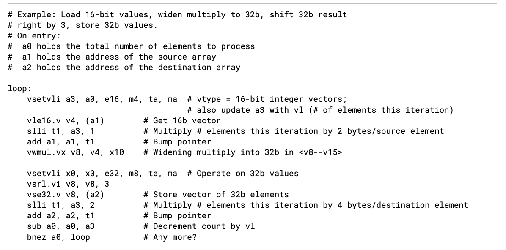

# RISC-V V Extension
## 1. Introduction

## 2. Implementation-defined Constant Parameters.
`Implementation-defined`: For microarchitecture implement RVV need to support these parameters.

`ELEN`: Element length. Width of an element in the vector.

`VLEN`: Vector length. Width of the vector register.

> VLEN <= 2^16

## 3. Vector Extension Programmer's Model
> The vector extension adds 32 vector registers, and seven unprivileged CSRs (`vstart`, `vxsat`, `vxrm`, `vcsr`, `vtype`, `vl`,
`vlenb`) to a base scalar RISC-V ISA.

`CSR`: Control and Status Register. 控制 CPU 行为、以及反映 CPU 当前状态的特殊寄存器。

These CSRs are "unprivileged", which means they are accessable in user mode.

### 3.1 Vector Registers
> The vector extension adds 32 architectural vector registers, v0-v31 to the base scalar RISC-V ISA. Each vector register has a fixed VLEN bits of state.

Vector Registers的长度是硬件固定的，可以改变的是VL（当前向量长度，用于部分寄存器操作）

### 3.2 Vector Context Status in `mstatus`
> A vector context status eld, VS, is added to `mstatus[10:9]` and shadowed in `sstatus[10:9]`. It is dened analogously to the floating-point context status field, `FS`.

`mstatus`, 是 Machine Status Register（M-mode 状态寄存器）

> Attempts to execute any vector instruction, or to access the vector CSRs, raise an illegal-instruction exception when
mstatus.VS is set to Off.

When `VS` is set to `off`, which means that doesn't "want" to support vector instruction set.

> When mstatus.VS is set to Initial or Clean, executing any instruction that changes vector state, including the vector CSRs, will change mstatus.VS to Dirty. Implementations may also change mstatus.VS from Initial or Clean to Dirty at any time, even when there is no change in vector state.

`mstatus.VS` 是一个 hint-like 的状态位，用于 OS 优化上下文切换。
硬件 必须在向量状态被修改时将 VS 设为 Dirty，但允许在任何时候保守地把 VS 设为 Dirty，即使实际状态没有变化，以简化实现并保证正确性。

> If `mstatus.VS` is Dirty, `mstatus.SD` is 1; otherwise, `mstatus.SD` is set in accordance with existing specications.

`mastatus.SD`: State Dirty(SD). If one of the FS, VS, XS(Other extensions' state) becomes one, SD will set to be one (dirty).

> Implementations may have a writable misa.V field. Analogous to the way in which the floating-point unit is handled, the
mstatus.VS field may exist even if misa.V is clear.

`misa.V`: Machien ISA registers, V field stands for whether the current ISA supports vector extendion. This is writable, means that OS or Hypervisor could turn on/off.

> Note: Allowing mstatus.VS to exist when misa.V is clear, enables vector emulation and simplfies handling of mstatus.VS in systems with writable misa.V

### 3.3 Vector Context Status in `vsstatus`
This part's design is used for virtualization. With the hypervisor extension, vector context status is maintained at both guest (`vsstatus.VS`) and host (`mstatus.VS`) levels. Vector execution is permitted only when both fields are non-Off. Any modification to vector state marks both contexts Dirty, allowing independent tracking of extended state for guest and host context switching. This design mirrors the floating-point virtualization model and supports vector emulation even when misa.V is clear.

### 3.4 Vector type register, vtype
> The read-only XLEN-wide vector type CSR, `vtype` provides the default type used to interpret the contents of the vector
register file, and can only be updated by `vset{i}vl{i}` instructions. The vector type determines the organization of
elements in each vector register, and how multiple vector registers are grouped. The `vtype` register also indicates how
masked-off elements and elements past the current vector length in a vector result are handled.

`XLEN-wide`: RV-32,X = 32. RV-64, x = 64.

`vtype`提供了vector register file 中数据的结构信息

#### 3.4.1 Vector selected element width vsew[2:0]
> The value in `vsew` sets the dynamic selected element width (SEW). By default, a vector register is viewed as being divided into VLEN/SEW elements.

#### 3.4.2 Vector Register Grouping(`vlmul[2:0]`)
> but the main reason for their inclusion is to allow double-width or larger elements to be operated on with the same vector length as single-width elements.

> Note: The vector architecture includes instructions that take multiple source and destination vector operands with different element widths,but the same number of elements. 

e.g. `vadd.vv vd, vs1, vs2`

> The effective LMUL (EMUL) of each vector operand is determined by the number of registers
required to hold the elements. For example, for a widening add operation, such as add 32-bit values to produce 64-bit results, a double-width result requires twice the LMUL of the single-width inputs.

> For a given supported fractional LMUL setting, implementations must support SEW settings between SEWMIN and LMUL * ELEN, inclusive.

`SEWMAX = LMUL_fraction * ELEN`
SEWMAX: 最大可选元素长度
ELEN: 硬件最大支持元素长度

> The use of vtype encodings with LMUL < SEWMIN/ELEN is reserved, but implementations can set vill if they do not support these congurations.

理论上可以支持 SEWMIN > LMUL * ELEN, 但是这样不会充分使用vector regster

#### 3.4.3. Vector Tail Agnostic and Vector Mask Agnostic vta and vma

`Tail Agnostic`: 对超出VL的部分不处理
`Mask Agnostic`: 对mask掉的元素不处理

> When a set is marked undisturbed, the corresponding set of destination elements in a vector register group retain the value
they previously held.

> When a set is marked agnostic, the corresponding set of destination elements in any vector destination operand can either
retain the value they previously held, or are overwritten with 1s. Within a single vector instruction, each destination element
can be either left undisturbed or overwritten with 1s, in any combination, and the pattern of undisturbed or overwritten with
1s is not required to be deterministic when the instruction is executed with the same inputs.

- vta = 0 -> undistturbed 元素一定保持原始值
- vta = 1 -> agnostic 元素可能被置1

两次同样的instruction当vta set to be one, 可能会出现不同的结果，硬件不做保证。


#### 3.4.4 Vector Type Illegal `vill`

> The vill bit is held in bit XLEN-1 of the CSR to support checking for illegal values with a branch on the sign bit.

`vill` is the MSB of the `vtype` register.


`vtype < 0` <=>`vill == 1`

> All bits of the vtype argument must be considered in determining if the value is supported by the implementation.

当有一条指令想要configure `vtype`的时候，very bit will be checked in determining `vill`

### 3.5 Vector Length Register `vl`
> The XLEN-bit-wide read-only vl CSR can only be updated by the vset{i}vl{i} instructions, and the *fault-only-first* vector load instruction variants.

*Fault-only-first*: special loads like `vleff.v`, which loads a stream of elements into vector registers utill a fault happens. Then this will modify the `vl` CSR to the number of elements successfully loaded.

### 3.6 Vector Byte Length **vlenb**
> The XLEN-bit-wide read-only CSR vlenb holds the value VLEN/8, i.e., the vector register length in bytes.

### 3.7 Vector Start Index CSR `vstart`
> Normally, vstart is only written by hardware on a trap on a vector instruction, with the vstart value representing the
element on which the trap was taken (either a synchronous exception or an asynchronous interrupt), and at which execution
should resume after a resumable trap is handled.

> The vstart CSR is writable by unprivileged code, but non-zero vstart values may cause vector instructions to run
substantially slower on some implementations, so vstart should not be used by application programmers. A few vector
instructions cannot be executed with a non-zero vstart value and will raise an illegal instruction exception as dened
below.

通常 允许写 vstart 是为了 异常恢复和系统软件，
但对普通程序来说，非零 vstart 会大幅降低性能

> Making `vstart` visible to unprivileged code supports user-level threading libraries. 

在user-level thread切换的时候不会陷入到内核

User-level thread v.s. kenel-level thread. 多个user level thread在kernel看来是一个。而kernel-level thread可以真正由内核调度。

### 3.8 Vector Fixed-Point Rounding Mode Register `vxrm`
> The vector fixed-point rounding-mode is given a separate CSR address to allow independent access, but is also reflected as a field in `vcsr`.

Rouding相关的信息同时存储在`vxrm` 和 `vcsr`中。

Round to nearest even:优先判断距离，当距离一致时，选择舍入结果为偶数。

> r = v[d-1] & (v[d-2:0]≠0 | v[d])

**距离优先：**

当v[d-1]为0 -> 不进位

当v[d-1]为1 -> 其余位任意位为1 -> 进位

**平局决胜：**

当v[d-1]为1 -> 其余为都为0 -> v[d]决定是否进位

### 3.9 Vector Fixed-Point Sturation Flage `vxsat`

### 3.10 Vector Control and Status Register `vcsr`
`vcsr[0]`: vxsat

`vcsr[2:1]`: vxrm[1:0]

### 3.11 State of Vector Extension at reset

## 4. Mapping of Vector Elements to Vector Register State
### 4.1 Mapping for `LMUL` = 1

### 4.2 Mapping for `LMUL` < 1
> When LMUL < 1, only the rst LMUL*VLEN/SEW elements in the vector register are used. The remaining space in the vector register is treated as part of the tail, and hence must obey the vta setting.

### 4.3 Mapping for `LMUL` > 1

### 4.4 Napping across Mixed-Width Operations
> The vector ISA is designed to support mixed-width operations without requiring additional explicit rearrangement
instructions. The recommended software strategy when operating on multiple vectors with different precision values is to
modify vtype dynamically to keep SEW/LMUL constant (and hence VLMAX constant).
The following example shows four different packed element widths (8b, 16b, 32b, 64b) in a VLEN=128b implementation.
The vector register grouping factor (LMUL) is increased by the relative element size such that each group can hold the same
number of vector elements (VLMAX=8 in this example) to simplify stripmining code.

`VLMAX` = `LMUL` × `VLEN` / `SEW` 

> A vector mask occupies only one vector register regardless of SEW and LMUL.
Each element is allocated a single mask bit in a mask vector register. The mask bit for element i is located in bit i of the mask
register, independent of SEW or LMUL.

## 5. Vector Instruction Formats
### 5.1 Scalar Operands
> Scalar operands can be immediates, or taken from the x registers, the f registers, or element 0 of a vector register. Scalar
results are written to an x or f register or to element 0 of a vector register. Any vector register can be used to hold a scalar
regardless of the current LMUL setting.

`x register`: general purpose register

`f regsiter`: floating point register

> We considered but did not pursue overlaying the f registers on v registers. The adopted approach reduces vector register pressure,
avoids  interactions  with  the  standard  calling  convention,  simplies  high-performance  scalar  floating-point  design,  and  provides
compatibility with the Znx ISA option. Overlaying f with v would provide the advantage of lowering the number of state bits in some
implementations, but complicates high-performance designs and would prevent compatibility with the proposed Znx ISA option.

`overlaying`: 让 f0–f31 和 v0–v31 物理上共享同一组硬件寄存器（比如 f0 就是 v0 的低 64 位）

### 5.2 Vector Operands
> Each vector operand has an effective element width (EEW) and an effective LMUL (EMUL) that is used to determine the size and location of all the elements within a vector register group. By default, for most operands of most instructions, EEW=SEW and EMUL=LMUL.

Example: `vadd.vv`

> Some vector instructions have source and destination vector operands with the same number of elements but different
widths, so that EEW and EMUL differ from SEW and LMUL respectively but EEW/EMUL = SEW/LMUL. 

> For example, most widening arithmetic instructions have a source group with EEW=SEW and EMUL=LMUL but have a destination group with EEW=2*SEW and EMUL=2*LMUL. Narrowing instructions have a source operand that has EEW=2*SEW and EMUL=2*LMUL
but with a destination where EEW=SEW and EMUL=LMUL.

`vwadd.vv vd, vs2, vs1`
- vs2, vs1：元素宽度 = SEW（如 16-bit
- vd：元素宽度 = 2×SEW（如 32-bit）
- 执行：vd[i] = (int)vs2[i] + (int)vs1[i]（无溢出）   

> Vector operands or results may occupy one or more vector registers depending on EMUL, but are always specied using the
lowest-numbered vector register in the group. Using other than the lowest-numbered vector register to specify a vector
register group is a reserved encoding.

When `LMUL` is set to 2, `v0`-`v1`, `v2`-`v3` form 2 register groups (logic vector). `vadd.vv v0, v2, v4` the lowest-numbered vector registers are used to specify the vector group.

> A destination vector register group can overlap a source vector register group only if one of the following holds:
- The destination EEW equals the source EEW.
- The destination EEW is smaller than the source EEW and the overlap is in the lowest-numbered part of the source
register group (e.g., when LMUL=1, `vnsrl.wi v0, v0, 3 `is legal, but a destination of v1 is not).

`vnsrl.wi v0, v0, 3 `: 假设当前SEW=32, 对 v0 中的每个 64 位无符号整数，执行逻辑右移 3 位，然后将结果的低 3 位截断（只保留低 32 位），存回 v0 的对应位置。

When executing this instruction. Source EEW=64 ELMUL=2, Destination EEW=32 ELMUL=1. It turns out that we only use one of the register of the register group. The spec says that "the lowest-numbered part of the source register group can be used." So we cannot use v1 as the destination.

- The destination EEW is greater than the source EEW, the source EMUL is at least 1, and the overlap is in the highest-
numbered part of the destination register group (e.g., when LMUL=8, `vzext.vf4 v0, v6` is legal, but a source of v0,
v2, or v4 is not).

`vzext.vf4 v0, v6`: Vector Zero Extend, 假设SEW = 32, Sorece EEW = 8, 指令会从 v6 中读取 8 位无符号整数，并高位补 0，扩展成 32 位，存入 v0.

> For the purpose of determining register group overlap constraints, mask elements have EEW=1.

v0中的mask elements EEW=1

> The overlap constraints are designed to support resumable exceptions in machines without register renaming.

> Any instruction encoding that violates the overlap constraints is reserved

### 5.3 Vector Masking
> The mask value used to control execution of a masked vector instruction is always supplied by vector register v0. Future vector extensions may provide longer instruction encodings with space for a full mask register specfier.

目前v0是为一个mask register, 将来需要一个位置来specify其他的vector register作为mask operand.

> The destination vector register group for a masked vector instruction cannot overlap the source mask register (v0), unless
the destination vector register is being written with a mask value (e.g., compares) or the scalar result of a reduction. These instruction encodings are reserved.

一般的指令v0无法overlap

#### 5.3.1 Mask Encoding

### 5.4. Prestart, Active, Inactive, Body, and Tail Element Definitions

## 6. Configuration-Setting Instructions
> One of the common approaches to handling a large number of elements is "stripmining" where each iteration of a loop handles some number of elements, and the iterations continue until all elements have been processed. The RISC-V vector
specication provides direct, portable support for this approach. The application specfies the total number of elements to be processed (the application vector length or AVL) as a candidate value for vl, and the hardware responds via a general-
purpose register with the (frequently smaller) number of elements that the hardware will handle per iteration (stored in vl),
based on the microarchitectural implementation and the vtype setting. A straightforward loop structure, shown in `Example
of stripmining and changes to SEW`, depicts the ease with which the code keeps track of the remaining number of elements
and the amount per iteration handled by hardware.

### 6.1 vtype encoding

```asm
vsetvl rd, rs1, rs2  
```
 - rd：返回实际设置的向量长度（vl）
 - rs1：期望的向量长度（avl，Application Vector Length）
 - rs2：向量类型寄存器（vtype，包含 SEW、LMUL、mask/tail 策略等）

### 6.2 AVL encoding
> When rs1 is not x0, the AVL is an unsigned integer held in the x register specied by rs1, and the new vl value is also written to the x register specied by rd.

> When rs1=x0 but rd!=x0, the maximum unsigned integer value (~0) is used as the AVL, and the resulting VLMAX is written to vl and also to the x register specied by rd.

rs=AVL

> When rs1=x0 and rd=x0, the instruction operates as if the current vector length in vl is used as the AVL, and the resulting value is written to vl, but not to a destination register. 
This form can only be used when VLMAX and hence vl is not actually changed by the new SEW/LMUL ratio. Use of the instruction with a new SEW/LMUL ratio that would result in a change of VLMAX is reserved. Implementations may set vill in this case.

使用当前 vl 作为 AVL，重新配置 vtype（SEW/LMUL等），但不改变 vl 的值，也不写回任何通用寄存器. 仅改变 SEW/LMUL 等配置，但保持向量长度不变。

### 6.3 Constraints on Setting vl

### 6.4 Example of stripmining and changes to SEW


## 7. Vector Loads and Stores
### 7.1 Vector Load/Store Instruction Encoding
> Vector memory unit-stride and constant-stride operations directly encode EEW of the data to be transferred statically in the instruction to reduce the number of vtype changes when accessing memory in a mixed-width routine. 

Unit-Stride（vle32.v）和 Strided（vlse32.v）指令的后缀数字 （如 32）直接指定了内存中数据的宽度。这个宽度独立于当前的 SEW 配置。这样在处理混合宽度数据的时候不用频繁的 vsetvl 更改SEW。

> Indexed operations use the explicit EEW encoding in the instruction to set the size of the indices used, and use SEW/LMUL to specify the data width.

Indexed 指令（vluxei32.v）的后缀数字（如 32）指定的是索引数组的宽度，而不是数据宽度。数据宽度仍由当前 SEW/LMUL 决定。
### 7.2 Vector Load/Store Addressing Modes
> The vector extension supports unit-stride, strided, and indexed (scatter/gather) addressing modes. Vector load/store base registers and strides are taken from the GPR x registers.

> Vector unit-stride operations access elements stored contiguously in memory starting from the base effective address.

> Vector constant-strided operations access the rst memory element at the base effective address, and then access
subsequent elements at address increments given by the byte offset contained in the x register specied by rs2.

> Vector indexed operations add the contents of each element of the vector offset operand specied by vs2 to the base
effective address to give the effective address of each element. The data vector register group has EEW=SEW, EMUL=LMUL,
while the offset vector register group has EEW encoded in the instruction and EMUL=(EEW/SEW)*LMUL.

数据向量的EEW=SEW, 偏移向量的EEW 由指令encoding(`vluxei16.v`) `EMUL=(EEW/SEW)*LMUL` 保证数据向量与偏移向量的元素个数一致，这样EMUL直接由EEW, SEW, LMUL决定。

> The indexed operations can also be used to access elds within a vector of objects, where the vs2 vector holds pointers to the base of
the objects and the scalar x register holds the offset of the member eld in each object. Supporting this case is why the indexed
operations were not dened to scale the element indices by the data EEW.

vs2 存每个对象的指针, rs1 存field offset -> rs1 不是有效的EEW。

> If the vector offset elements are narrower than XLEN, they are zero-extended to XLEN before adding to the base effective
address. If the vector offset elements are wider than XLEN, the least-signicant XLEN bits are used in the address
calculation. An implementation must raise an illegal instruction exception if the EEW is not supported for offset elements.

`XLEN`: RV32 -> XLEN = 32

> Vector unit-stride and constant-stride memory accesses do not guarantee ordering between individual element accesses.
The vector indexed load and store memory operations have two forms, ordered and unordered. The indexed-ordered
variants preserve element ordering on memory accesses.

### 7.3 Vector Load/Store Width Encoding
> Vector loads and stores have an EEW encoded directly in the instruction. The corresponding EMUL is calculated as EMUL =
(EEW/SEW)*LMUL. If the EMUL would be out of range (EMUL>8 or EMUL<1/8), the instruction encoding is reserved. 
> The vector register groups must have legal register specfiers for the selected EMUL, otherwise the instruction encoding is reserved.

假设 EMUL = 4, v4 合法而 v31 不合法

> Vector unit-stride and constant-stride use the EEW/EMUL encoded in the instruction for the data values, while vector indexed loads and stores use the EEW/EMUL encoded in the instruction for the index values and the SEW/LMUL encoded in vtype for the data values.

> Vector loads and stores are encoded using width values that are not claimed by the standard scalar floating-point loads and
stores.

scalar floating-points loads 已经用一些width来编码，向量则用没有用过的值编码

> Implementations must provide vector loads and stores with EEWs corresponding to all supported SEW settings. Vector load/store encodings for unsupported EEW widths must raise an illegal instruction exception.

当前所有支持的SEW宽度，都应该被load store支持

### 7.4 Vector Unit-Stride Instructions
> Additional unit-stride mask load and store instructions are provided to transfer mask values to/from memory. These operate similarly to unmasked byte loads or stores (EEW=8), except that the effective vector length is evl=ceil(vl/8) (i.e. EMUL=1), and the destination register is always written with a tail-agnostic policy.

假设掩码为"1100110011001100" 那么evl=ceil(vl/8) 即从内存中load 2B到掩码

### 7.5 Vector Strided Instructions
> Element accesses within a strided instruction are unordered with respect to each other.

> When rs2=x0, then an implementation is allowed, but not required, to perform fewer memory operations than the number of active elements, and may perform different numbers of memory operations across different dynamic executions of the
same static instruction.

rs1 is base address, rs2 is byte stride. When byte stride is set to zero.