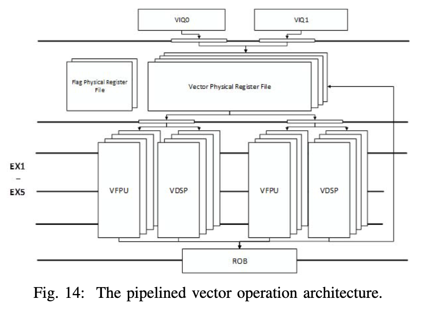

# Xuantie-910
## Introduction
> Academic work - The UC Berkeley released the in-order Rocket core, the out-of-order core BOOM and the open-source design generator tool [9], [10]. Both Rocket and BOOM are capable of booting Linux. ETH Zurich and Universit`a di Bologna offered three flavors of RISC-V cores in the PULP platform [4] - RI5CY (32-bit, 4-stage pipeline), Zero-riscy (32-bit, 2-stage pipeline) and Ariane (64-bit, 6-stage pipeline) [32]. Also, IIT-Madras has been working on a series of Shakti RISC-V processors, from a 3-stage pipeline in-order core to an out-of-order multiple threading core at a target operating frequency of 1.5-2.5 GHz [5], [13]

Whether need to survey on those processors?

## Overview

1 `cluster` ~ 4 `cores`
`L1 icache`: 32/64 KB
`L1 dcache`: 32/64 KB

1 `cluster` ~ 8/16-way associated L2 cache.

> The pipeline of the XT-910 core is shown in Fig. 4. The
”frontend” of the pipeline consists of 7 stages (i.e., IF ∼ RF). The instruction fetch unit (IFU) uses a hybrid predictor,
which makes predictions of branch direction, branch address,
function return address and indirect jump address. 
The instruction decoding unit (IDU) can decode 3 instructions
simultaneously and can rename up to 4 instructions using
physical registers. The out-of-order issue engine can issue up
to 8 instructions.
The ”backend” of the pipeline has multiple
execution units, including two single-cycle ALUs, one single-
cycle branch jump unit, one dual-issue out-of-order load &
store unit, two scalar floating point units and two vector
execution units. The multi-cycle ALU unit and the division
unit share one pipe; the integer multiplication units and the
two single-cycle ALUs share a pipe. The LSU supports
unaligned memory data access, and supports multi-mode
multi-stream prefetching to increase data access bandwidth.
More details about the IFU, the execution core, the memory
subsystem and the memory management unit (MMU) will be
discussed in the following sessions

## Instruction Fetch Unit

## 4. Execution Core
> The execution core includes ID, IR, IS, RF, EX1∼EX4,
RT1∼RT2 pipeline stages. The IDU is from the ID to the RF
stages. The ID stage decomposes and decodes instructions. **It splits instruction into micro-instructions based on the attributes (e.g., instruction type, number of operands, and number of write-back operations, etc.)**. **Zero-latency decoupling of scalar and vector instructions is supported**. 

> The IS stage performs out-of-order instruction scheduling.
The processor has 8 instruction slots, which are shared by all
the issued instructions. Depending on the available resources
and workload of the execution unit, multiple independent out-
of-order issue queues are loaded. The issue queues use an
Age-Vector based scheduling algorithm to issue instructions to
the shared instruction slots. In addition, the issue queues also
support dynamic load balancing by monitoring the workload
in the pipeline and adjusting the priority in real time.

> The EX stage contains 8 pipes, which can process 2
arithmetic operation instructions, 1 branch instruction, 1 load
instruction, 2 store instructions (i.e., the pseudo double store
instructions, as will be discussed later), 2 scalar floating point
and **vector instructions** in parallel.

Vector instructions are decomposed to micro-ops, and at IS stage OoO scheduling is applied.

## 5. Memory Sub-System
### 5.1 Dual-issue out-of-order LSU

`LSU`: Load Store Unit

>   The LSU can process one load
instruction and one store instruction in parallel. The dual-
issue LSU requires dedicated load pipe and store pipe. Each
pipe contains four pipeline stages, namely address generation (AG), data cache (DC), data alignment (DA), and write-back
(WB), as shown in Fig. 9. At the AG stage, the load and store
instructions generate addresses, access the uTLB, and convert
virtual addresses to physical addresses. At the DC stage, load
and store instructions access the data cache. At the DA stage,
data alignment is completed. Finally, the data is written back
to the physical register file at the WB stage.

## 7. Vector Instruction Extension
> Based on the 0.7.1 stable release version of RISC-V Vector specification XT-910 supports the exeution of dual-issue out-of-order vector operation instructions.

`dual-issue`: Issue two instructions in one cycle.

> Its vector pipeline consists of multiple identical vector slices. **Each vector slice has a complete 64-bit data path, including a multi-port 64-bit vector physical register file and two out-of-order vector floating-point and integer execution pipelines.** Each pipeline supports a single 64-bit integer or double-precision floating-point operations, or two 32-bit integer or single-precision
floating-point operations. Each vector slice has its independent registers, forwarding path, and execution data path. Only very few operations, such as wide, narrow, and permutation, need to exchange data across slices.

`Slice`: Lane

It turns out that a seris of micro-ops are dispatched to different vector slices(VIQ) after scheduling. Each vector slice then “sees” a batch of scalar-like operations corresponding to its assigned elements.

`VIQ`: Vector Issue Queue

`VFPU`: Vector Floating Point Unit

`VDSP`: Vector Digital Signal Processing Unit

`ROB`: Reorder Buffer

> Fig. 14 shows the vector slices based architecture, which
greatly reduces the layout and routing costs caused by the
increasing bit-width. XT-910 can support the operation width
from 64 bits to 1024 bits. However, for deeply pipelined
out-of-order multi-core processors, the maximum bit-width
of load/store access is largely limited by the bus and cache
architecture. Further, a higher bit-width increases the cost of
memory access and exacerbates cache coherence problem. To
balance the bit width ratio of arithmetic-logic operations to
load/store access, two vector slices with 128-bit VLEN and
SLEN are recommended. With this configuration, XT-910 can
generate a total of 256-bit operation results in one clock cycle,
and complete a 128-bit vector load/store operation.

Two slices are selected to balance the computational capability and memory bandwidth.

`VLEN`: Vector register length
`SLEN`: Vector slice lenght

256-bit operation results = 2 slices × SLEN

> The vector operation instruction itself does not specify the
element format and operation bit width. These vector parame-
ters are set through a configuration instruction (vsetvl/vsetvli).
The parameter configuration instruction only needs to specify
the number of elements to be processed, and the hardware can
determine the specific operation width and number of elements
according to VLMAX. This feature ensures that software
does not need to know the underlying hardware parameters. but can run on hardware platforms with different computing
bitwidths. **However, this is not friendly to deeply pipelined
processor architecture.** The vector parameter correlation has
to be inferred from each vector operation instruction and its
preceding parameter configuration instruction, slowing down
the execution of vector operation instruction. To alleviate the
performance loss, XT-910 enables vector parameter prediction
and speculative execution of vector operation, which only
cause speculation failures when the vl changes.

`Operation bit width`: the element size.

> Most vector operations can be completed within 3-4 clock
cycles. Multiplying single and double precision floating point
vectors takes 5 clock cycles. Integer division and floating-point
division take 6 to 25 clock cycles