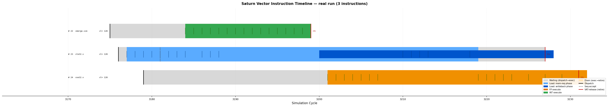
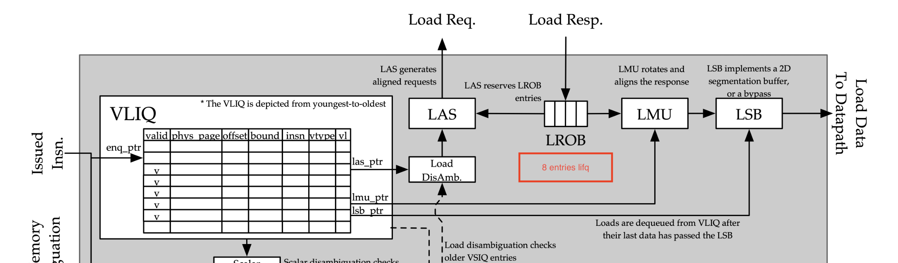

# Report

## Fix mca simulator
Cycle differences in instructions sequence `vmv.vi -> vle32.v(mask)`

Simulation results of Saturn RTL:


Saturn `vmv` and `vmerge` the same funct6 encoding
```cpp
// vd[i] = mask[i] ? imm : vs2[i]
vmerge.vim vd, vs2, imm, v0

// vd[i] = imm
vmv.v.i vd, imm
```


`vmerge` uses vm=0, while `vmv` uses vm=1 and vs2=0. Saturn’s decoder does not include vm in its lookup key, both instructions select the same MERGE execution path. When vm=1, the backend supplies an all-ones merge mask, so every element selects the vs1, scalar, or immediate operand, producing an unconditional move. 

Two problems:
1. Load sequencer can only issue Uop writeback after `vmerge`, `vmv`.
2. AddrGen doesn't send memory request in a consecutive way.

For problem1:
MERGE execution path need to read mask register (v0), and following masked load also need to read v0. -> structural hazard, issue of masked load need to delay.

For problem2: 
Saturn's replaying mechanism in load path(within VMU)


When load response arrived, but LROB is full, corresponding entries in lifq (load in-flight queue) will mark a `must-replay`, this signal will interlock the normal address sequencing and memory request. At next cycle addGen(LAS) will check (!store-request && current arbitor valid) and send `replay-req` clearing the corresponding `must-replay` signal.

Current mca implementation doesn't validate !store-request, and the benchmark looks good. around 20% difference -> less than 1%.

## Running result of rivec benchmarks
Rel Diff = Abs Diff / MCA

| Benchmark      | Saturn |   MCA | Abs Diff | Rel Diff |
| -------------- | -----: | ----: | -------: | -------: |
| axpy           |    279 |   240 |       39 |   16.25% |
| blackscholes   |   3401 |  3377 |       24 |    0.71% |
| particlefilter |  49490 | 39554 |     9936 |   25.12% |
| streamcluster  |   1071 |  1002 |       69 |    6.89% |
| swaptions      |  - | - |     - |    - |
| somier-nowarmup|  - |-  |    - |    - |

Date: 7.4

Config: VLEN=256 DLEN=128


| Benchmark      | Saturn |   MCA | Abs Diff | Rel Diff |
| -------------- | -----: | ----: | -------: | -------: |
| axpy           |     81 |    87 |        6 |    6.90% |
| blackscholes   |  10498 | 10359 |      139 |    1.34% |
| particlefilter |  42758 | 35266 |     7492 |   28.90% |
| streamcluster  |    988 |   972 |       16 |    1.65% |
| swaptions      |  92476 | 86209 |     6267 |    7.26% |
| somier-nowarmup|3903944 |3887616|    16328 |    0.42% |

Date: 7.10

Config: VLEN=1024 DLEN=256

For benchmark somier it triggers saturns times out, so only the trace of warm-up run left.

