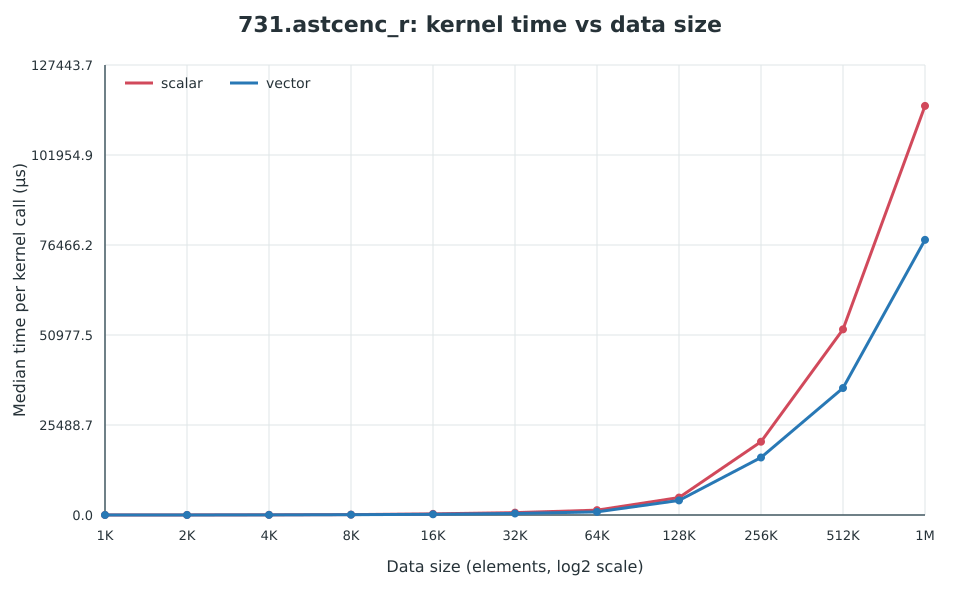
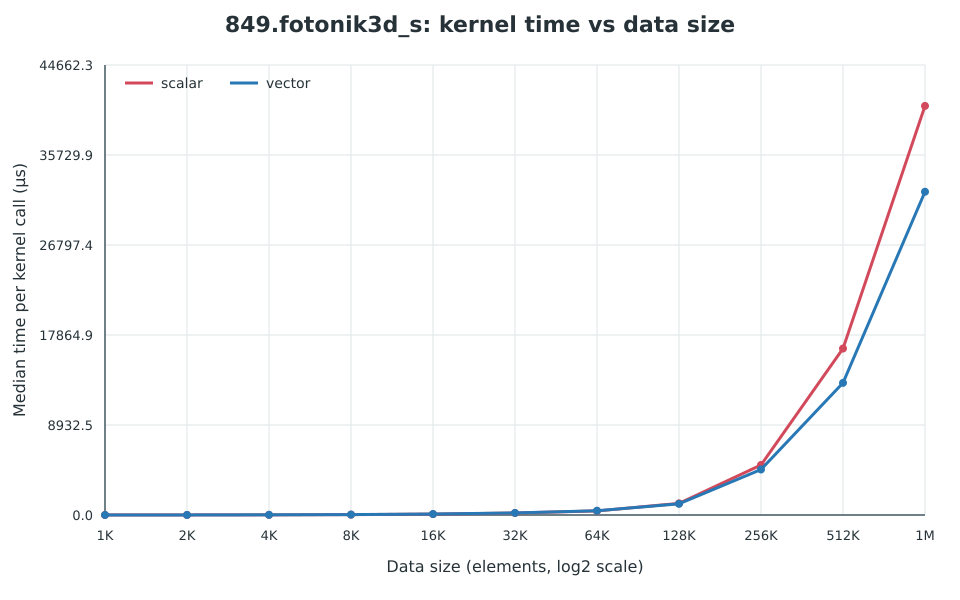
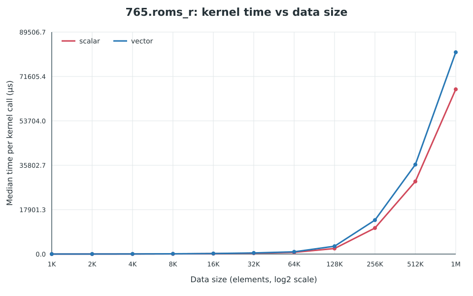
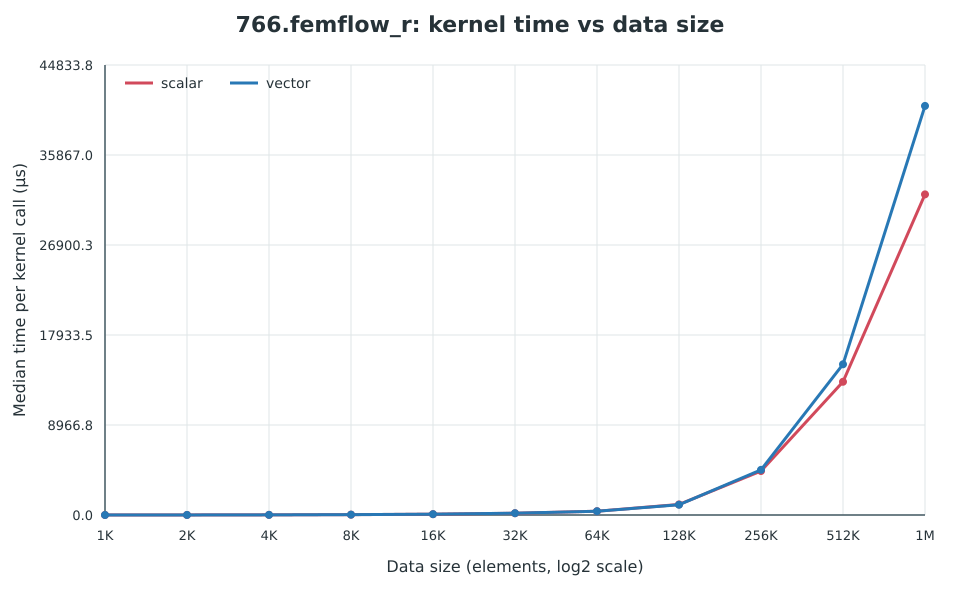

# Report

## Swap over entire spec2026
Use perf + test size, select the benchmarks that `vuxei` as hotspot

- 731.astcenc_r
- 749.fotonik3d_r
- 765.roms_r
- 766.femflow_r

## Extracted kernels
731.astcenc_r

```cpp
void hotspot_kernel(size_t n, const double *restrict r,
                    const double *restrict g, const double *restrict b,
                    const uint32_t *restrict texel, double *restrict error)
{
#pragma clang loop vectorize(enable)
    for (size_t i=0; i<n; ++i) {
        size_t t=texel[i];
        double x=r[t], y=g[t], z=b[t];
        double pu=0.5773502691896258*(x+y+z);
        double du0=pu*0.5773502691896258-x;
        double du1=pu*0.5773502691896258-y;
        double du2=pu*0.5773502691896258-z;
        double ps=0.7071067811865476*(x+y);
        error[i]+=du0*du0+du1*du1+du2*du2+ps*ps+z*z;
    }
}
```

749.fotonik3d_r

```fortran
! Standalone form of the hot three-dimensional loop from SPEC CPU2026
! 749.fotonik3d_r material_mod::mat_updateE.  This source exists only to make
! the generated assembly reproducible; the benchmark executable links the
! checked-in mat_updatee_kernel.s directly.
subroutine mat_updatee_kernel(nx, ny, nz, hx, hy, hz, ex, ey, ez, &
                              iepx, iepy, iepz, dbdx, dbdy, dbdz) &
    bind(C, name="mat_updatee_kernel")
  use, intrinsic :: iso_c_binding, only : c_int, c_int8_t, c_double
  implicit none

  integer(c_int), value, intent(in) :: nx, ny, nz
  real(c_double), intent(in) :: hx(0:nx,0:ny,0:nz)
  real(c_double), intent(in) :: hy(0:nx,0:ny,0:nz)
  real(c_double), intent(in) :: hz(0:nx,0:ny,0:nz)
  real(c_double), intent(inout) :: ex(0:nx,0:ny,0:nz)
  real(c_double), intent(inout) :: ey(0:nx,0:ny,0:nz)
  real(c_double), intent(inout) :: ez(0:nx,0:ny,0:nz)
  integer(c_int8_t), intent(in) :: iepx(nx,ny,nz)
  integer(c_int8_t), intent(in) :: iepy(nx,ny,nz)
  integer(c_int8_t), intent(in) :: iepz(nx,ny,nz)
  real(c_double), intent(in) :: dbdx(0:127), dbdy(0:127), dbdz(0:127)

  integer(c_int) :: i, j, k, mp

  do k = 1, nz
    do j = 1, ny
      do i = 1, nx
        mp = int(iepx(i,j,k), kind=c_int)
        ex(i,j,k) = ex(i,j,k) + &
                    dbdy(mp) * (hz(i,j,k) - hz(i,j-1,k)) + &
                    dbdz(mp) * (hy(i,j,k-1) - hy(i,j,k))

        mp = int(iepy(i,j,k), kind=c_int)
        ey(i,j,k) = ey(i,j,k) + &
                    dbdz(mp) * (hx(i,j,k) - hx(i,j,k-1)) + &
                    dbdx(mp) * (hz(i-1,j,k) - hz(i,j,k))

        mp = int(iepz(i,j,k), kind=c_int)
        ez(i,j,k) = ez(i,j,k) + &
                    dbdx(mp) * (hy(i,j,k) - hy(i-1,j,k)) + &
                    dbdy(mp) * (hx(i,j-1,k) - hx(i,j,k))
      end do
    end do
  end do
end subroutine mat_updatee_kernel
```

765.rom_r

```cpp
void hotspot_kernel(size_t n, const double *restrict u,
                    const double *restrict rhs, const double *restrict hz,
                    const uint32_t *restrict kmap, double *restrict out)
{
#pragma clang loop vectorize(enable)
    for (size_t i=0; i<n; ++i) {
        size_t k=kmap[i];
        out[i]+=0.5*(u[k]+u[(k+1)%n])+rhs[i]/(hz[k]+hz[(k+1)%n]+1.0);
    }
}
```

766.femflow_r
```cpp
void hotspot_kernel(size_t n, const double *restrict values,
                    const double *restrict shape_value,
                    const double *restrict shape_deriv,
                    const uint32_t *restrict renumber, double *restrict result)
{
    size_t end=n-n%5;
#pragma clang loop vectorize(enable)
    for (size_t i=0; i<end; ++i) {
        size_t r=renumber[i];
        result[i]+=values[r]*shape_value[i]+values[r]*shape_deriv[i];
    }
}
```
## Running Results

### 731.astcenc_r



### 749.fotonik3d_s



### 765.roms_r



### 766.femflow_r



### Detailed Measurements

Each scalar/vector result contains 5 samples. Times are shown as median [min–max] in milliseconds. Speedup is calculated as scalar median / vector median; values above 1 mean the vector variant is faster.

#### 731.astcenc_r

| Data size | Scalar median [min–max] (ms) | Vector median [min–max] (ms) | Speedup |
|---:|---:|---:|---:|
| 1,024 | 0.007845 [0.007837–0.007859] | 0.005722 [0.005721–0.005728] | 1.37× |
| 2,048 | 0.016591 [0.016574–0.016638] | 0.011857 [0.011845–0.011893] | 1.40× |
| 4,096 | 0.044520 [0.044466–0.044693] | 0.034044 [0.034015–0.034085] | 1.31× |
| 8,192 | 0.104922 [0.104874–0.104932] | 0.087532 [0.087272–0.087769] | 1.20× |
| 16,384 | 0.321080 [0.319961–0.321652] | 0.201523 [0.201121–0.201572] | 1.59× |
| 32,768 | 0.669656 [0.669160–0.670119] | 0.426898 [0.426369–0.430500] | 1.57× |
| 65,536 | 1.374008 [1.370672–1.394377] | 0.882697 [0.882213–0.908352] | 1.56× |
| 131,072 | 4.939607 [4.770066–5.059213] | 4.129131 [4.060721–4.266180] | 1.20× |
| 262,144 | 20.754267 [20.544467–20.824267] | 16.284767 [16.255800–16.477100] | 1.27× |
| 524,288 | 52.578133 [52.055733–53.516533] | 35.960600 [35.792533–36.334067] | 1.46× |
| 1,048,576 | 115.857875 [115.294000–117.209750] | 77.922125 [77.666250–79.422875] | 1.49× |

#### 765.roms_r

| Data size | Scalar median [min–max] (ms) | Vector median [min–max] (ms) | Speedup |
|---:|---:|---:|---:|
| 1,024 | 0.007736 [0.007733–0.007741] | 0.012191 [0.012190–0.012255] | 0.63× |
| 2,048 | 0.015605 [0.015587–0.015630] | 0.024689 [0.024680–0.024829] | 0.63× |
| 4,096 | 0.032581 [0.032571–0.032605] | 0.050456 [0.050398–0.050581] | 0.65× |
| 8,192 | 0.070307 [0.070282–0.070363] | 0.105514 [0.105334–0.105736] | 0.67× |
| 16,384 | 0.164242 [0.164006–0.165219] | 0.220391 [0.220088–0.220807] | 0.75× |
| 32,768 | 0.338488 [0.337840–0.341008] | 0.449795 [0.448820–0.450168] | 0.75× |
| 65,536 | 0.693672 [0.689221–0.723861] | 0.912836 [0.910172–0.928443] | 0.76× |
| 131,072 | 2.245098 [2.205623–2.339393] | 3.166066 [3.077770–3.193000] | 0.71× |
| 262,144 | 10.502800 [10.412233–10.598400] | 13.700867 [13.582767–13.810300] | 0.77× |
| 524,288 | 29.275867 [29.172333–29.282600] | 36.087533 [35.998000–36.279533] | 0.81× |
| 1,048,576 | 66.430750 [66.110500–66.607875] | 81.369750 [80.846375–81.907250] | 0.82× |

#### 766.femflow_r

| Data size | Scalar median [min–max] (ms) | Vector median [min–max] (ms) | Speedup |
|---:|---:|---:|---:|
| 1,024 | 0.002270 [0.002264–0.002283] | 0.002102 [0.002095–0.002120] | 1.08× |
| 2,048 | 0.005566 [0.005543–0.005624] | 0.005175 [0.005085–0.005178] | 1.08× |
| 4,096 | 0.014140 [0.014079–0.014186] | 0.013911 [0.013835–0.013966] | 1.02× |
| 8,192 | 0.033387 [0.033238–0.033415] | 0.034651 [0.034518–0.034863] | 0.96× |
| 16,384 | 0.082420 [0.082395–0.082525] | 0.083006 [0.082855–0.083629] | 0.99× |
| 32,768 | 0.175922 [0.175684–0.177918] | 0.180111 [0.179709–0.180623] | 0.98× |
| 65,536 | 0.377033 [0.364361–0.386295] | 0.374320 [0.372836–0.379254] | 1.01× |
| 131,072 | 1.049705 [1.008131–1.095721] | 1.023443 [1.008869–1.054246] | 1.03× |
| 262,144 | 4.379967 [4.350733–4.446100] | 4.498433 [4.471700–4.596767] | 0.97× |
| 524,288 | 13.273733 [13.248733–13.632333] | 15.015200 [14.963000–15.149067] | 0.88× |
| 1,048,576 | 31.943250 [31.832000–31.964125] | 40.758000 [40.386125–41.642000] | 0.78× |

#### 820.cloverleaf_s

| Data size | Scalar median [min–max] (ms) | Vector median [min–max] (ms) | Speedup |
|---:|---:|---:|---:|
| 1,024 | 0.006322 [0.006049–0.006476] | 0.006066 [0.006055–0.006071] | 1.04× |
| 2,048 | 0.016935 [0.016909–0.017002] | 0.012810 [0.012766–0.012976] | 1.32× |
| 4,096 | 0.043506 [0.043468–0.043537] | 0.032794 [0.032771–0.033052] | 1.33× |
| 8,192 | 0.101384 [0.101298–0.101542] | 0.083178 [0.082779–0.083439] | 1.22× |
| 16,384 | 0.227600 [0.227088–0.228133] | 0.193111 [0.192781–0.193486] | 1.18× |
| 32,768 | 0.472070 [0.471738–0.472283] | 0.408553 [0.408508–0.410135] | 1.16× |
| 65,536 | 0.962262 [0.960779–0.963631] | 0.841754 [0.840205–0.845672] | 1.14× |
| 131,072 | 3.007082 [2.857820–3.154590] | 3.056672 [2.908557–3.195574] | 0.98× |
| 262,144 | 13.045967 [12.997100–13.246100] | 12.756267 [12.681700–12.856567] | 1.02× |
| 524,288 | 36.960267 [36.903933–37.245533] | 35.667267 [35.626867–36.021533] | 1.04× |
| 1,048,576 | 82.748625 [82.701125–83.629250] | 81.529250 [81.355125–82.462000] | 1.01× |

#### 849.fotonik3d_s

| Data size | Scalar median [min–max] (ms) | Vector median [min–max] (ms) | Speedup |
|---:|---:|---:|---:|
| 1,024 | 0.002541 [0.002533–0.002549] | 0.002724 [0.002696–0.003222] | 0.93× |
| 2,048 | 0.006232 [0.006195–0.006257] | 0.006395 [0.006351–0.006443] | 0.97× |
| 4,096 | 0.015169 [0.015105–0.015176] | 0.016982 [0.016891–0.017003] | 0.89× |
| 8,192 | 0.035961 [0.035848–0.036240] | 0.040639 [0.040565–0.040867] | 0.88× |
| 16,384 | 0.091287 [0.090934–0.092117] | 0.096596 [0.096320–0.096951] | 0.95× |
| 32,768 | 0.194807 [0.194221–0.195029] | 0.205701 [0.205340–0.206836] | 0.95× |
| 65,536 | 0.404967 [0.403246–0.412795] | 0.421689 [0.420680–0.422197] | 0.96× |
| 131,072 | 1.154164 [1.138262–1.180639] | 1.111721 [1.076197–1.139164] | 1.04× |
| 262,144 | 4.965667 [4.788900–5.100233] | 4.517300 [4.476133–4.555433] | 1.10× |
| 524,288 | 16.523333 [16.355200–16.535933] | 13.113867 [13.092533–13.219133] | 1.26× |
| 1,048,576 | 40.602125 [40.483250–40.662125] | 32.082875 [31.956375–32.549750] | 1.27× |

#### 865.roms_s

| Data size | Scalar median [min–max] (ms) | Vector median [min–max] (ms) | Speedup |
|---:|---:|---:|---:|
| 1,024 | 0.007745 [0.007734–0.007756] | 0.012190 [0.012175–0.012240] | 0.64× |
| 2,048 | 0.015606 [0.015593–0.015619] | 0.024715 [0.024702–0.024828] | 0.63× |
| 4,096 | 0.032578 [0.032544–0.032742] | 0.050506 [0.050477–0.050643] | 0.65× |
| 8,192 | 0.070246 [0.070090–0.070339] | 0.105398 [0.105366–0.105958] | 0.67× |
| 16,384 | 0.164111 [0.163961–0.164416] | 0.220379 [0.220166–0.220697] | 0.74× |
| 32,768 | 0.338139 [0.337717–0.338660] | 0.449537 [0.449020–0.453922] | 0.75× |
| 65,536 | 0.690287 [0.687689–0.704451] | 0.914516 [0.911115–0.935008] | 0.75× |
| 131,072 | 2.305443 [2.237721–2.491295] | 3.206262 [3.101721–3.304148] | 0.72× |
| 262,144 | 10.519033 [10.413067–10.595167] | 13.520833 [13.422300–13.880633] | 0.78× |
| 524,288 | 29.246400 [29.109067–29.370533] | 36.163200 [35.980333–36.414200] | 0.81× |
| 1,048,576 | 66.527875 [66.098500–66.849375] | 80.835125 [80.552375–81.390875] | 0.82× |
