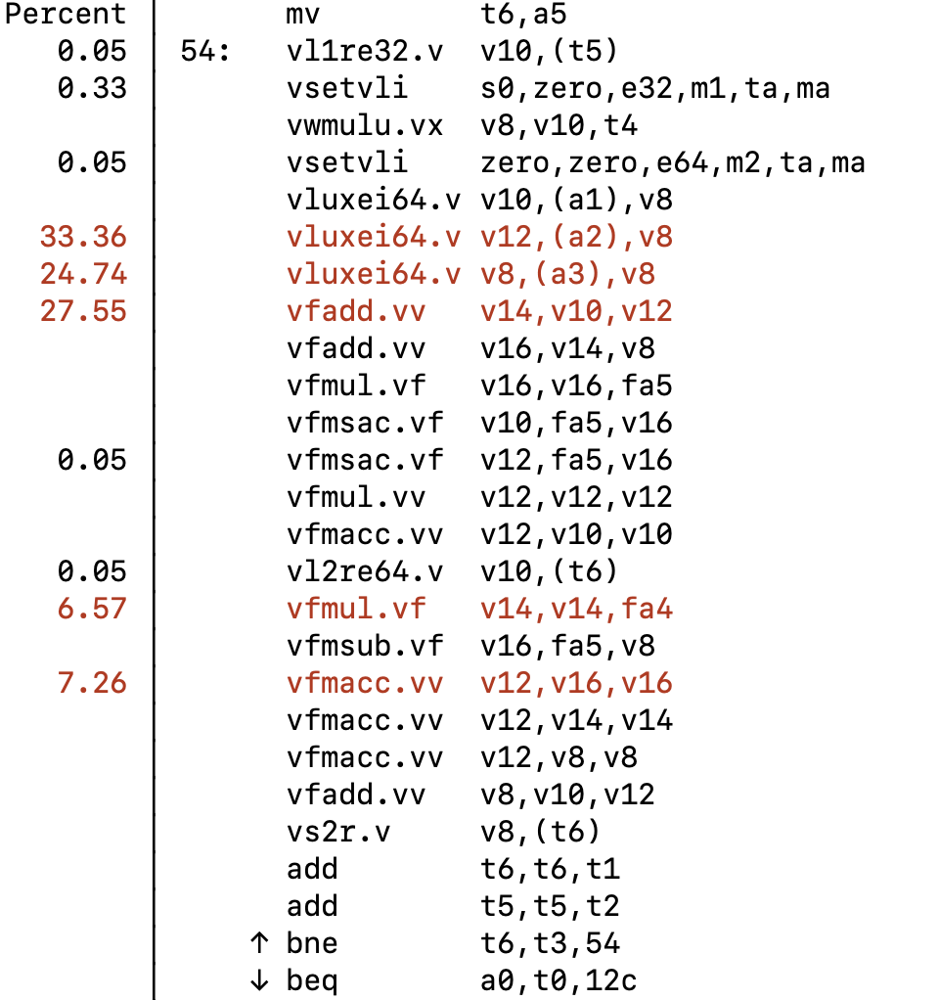
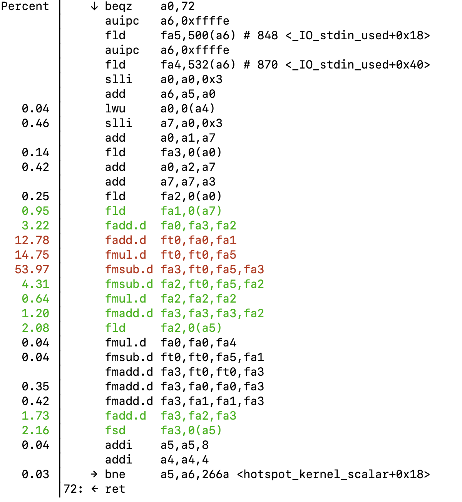
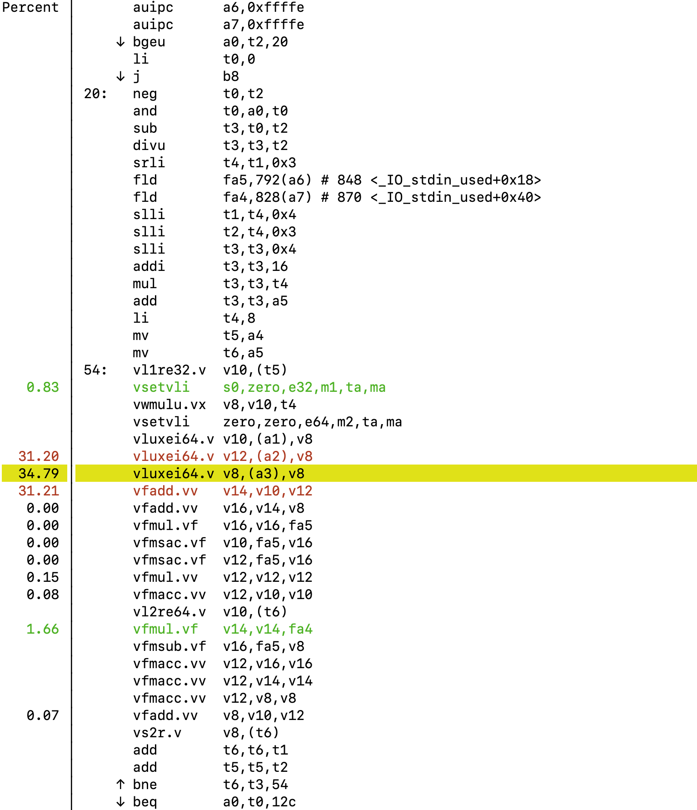
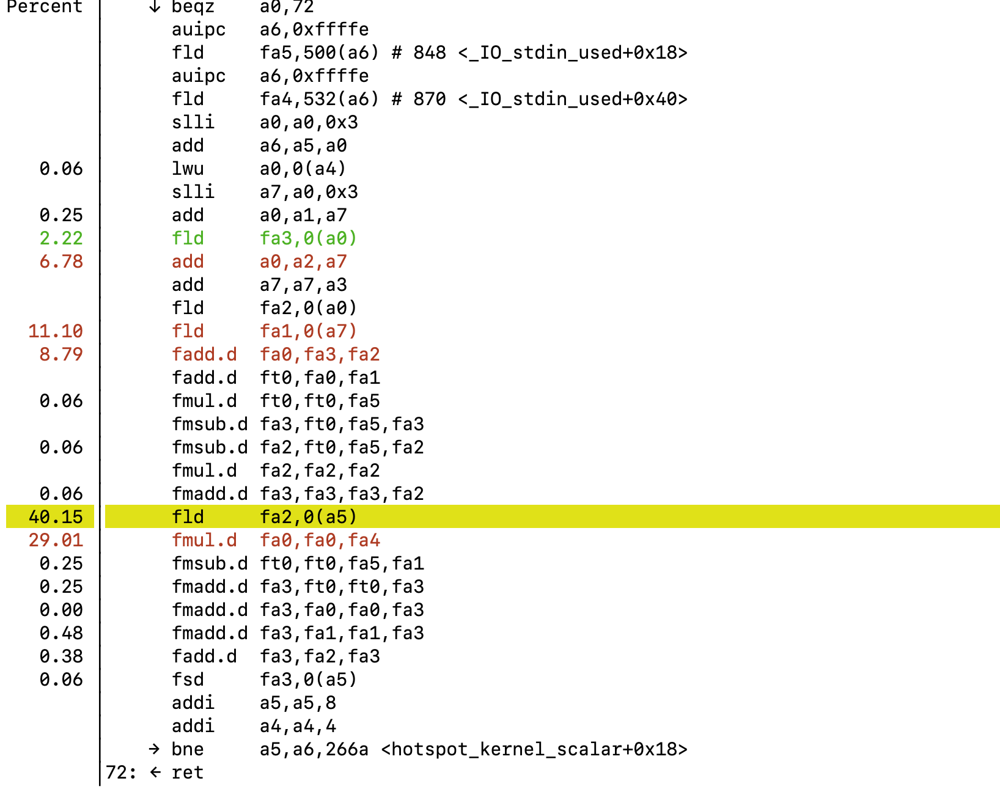

# Report

## Spec2026 kernel profiling

### Spec2026 ref workload.

| Benchmark         | Input Size Unit                     | Meaning of 1×                                                      |
| ----------------- | ----------------------------------- | ------------------------------------------------------------------ |
| `731.astcenc_r`   | Texels                              | Largest reference image: (2048 * 2048 = 4194304) texels            |
| `749.fotonik3d_r` | 3D grid dimensions (`nx × ny × nz`) | (120 * 470 * 120 = 6768000) updated cells                          |
| `765.roms_r`      | Flattened grid elements             | (1024 * 128 * 30 = 3932160) elements                               |
| `766.femflow_r`   | DoFs/interpolation elements         | 1020000 degrees of freedom                                         |

### Experiment Results

1x workload experiment result.

| kernel | X100 scalar/vector (ns/element) | X100 speedup | A100 scalar/vector (ns/element) | A100 speedup |
|---|---:|---:|---:|---:|
| 731.astcenc_r | 116.189 / 84.237 | **1.379x** | 497.191 / 415.876 | **1.196x** |
| 749.fotonik3d_r | 15.842 / 42.127 | **0.376x** | 36.217 / 113.027 | **0.320x** |
| 765.roms_r | 69.507 / 87.197 | **0.797x** | 368.691 / 341.547 | **1.079x** |
| 766.femflow_r | 30.381 / 39.300 | **0.773x** | 146.343 / 134.240 | **1.090x** |

- On X100 731.astcenc_r is the only vector-win.
- On A100 731, 765, 766 vector wins.

X100

| kernel | workload | scalar ns/element | vector ns/element | speedup |
|---|---:|---:|---:|---:|
| 731.astcenc_r | 0.5x | 114.769 | 80.588 | **1.424x** |
| 731.astcenc_r | 1x | 116.189 | 84.237 | **1.379x** |
| 731.astcenc_r | 2x | 114.301 | 86.796 | **1.317x** |
| 731.astcenc_r | 4x | 120.168 | 97.117 | **1.237x** |
| 749.fotonik3d_r | 0.5x | 14.699 | 39.106 | **0.376x** |
| 749.fotonik3d_r | 1x | 15.842 | 42.127 | **0.376x** |
| 749.fotonik3d_r | 2x | 16.396 | 43.903 | **0.373x** |
| 749.fotonik3d_r | 4x | 16.113 | 42.510 | **0.379x** |
| 765.roms_r | 0.5x | 67.309 | 83.771 | **0.803x** |
| 765.roms_r | 1x | 69.507 | 87.197 | **0.797x** |
| 765.roms_r | 2x | 71.113 | 89.680 | **0.793x** |
| 765.roms_r | 4x | 73.561 | 93.341 | **0.788x** |
| 766.femflow_r | 0.5x | 25.116 | 28.431 | **0.883x** |
| 766.femflow_r | 1x | 30.381 | 39.300 | **0.773x** |
| 766.femflow_r | 2x | 32.630 | 45.107 | **0.723x** |
| 766.femflow_r | 4x | 34.022 | 48.575 | **0.700x** |

A100

| kernel | workload | scalar ns/element | vector ns/element | speedup |
|---|---:|---:|---:|---:|
| 731.astcenc_r | 0.5x | 490.199 | 411.524 | **1.191x** |
| 731.astcenc_r | 1x | 497.191 | 415.876 | **1.196x** |
| 731.astcenc_r | 2x | 514.999 | 422.953 | **1.218x** |
| 731.astcenc_r | 4x | 556.865 | 442.580 | **1.258x** |
| 749.fotonik3d_r | 0.5x | 35.809 | 113.385 | **0.316x** |
| 749.fotonik3d_r | 1x | 36.217 | 113.027 | **0.320x** |
| 749.fotonik3d_r | 2x | 36.125 | 112.952 | **0.320x** |
| 749.fotonik3d_r | 4x | 34.485 | 113.143 | **0.305x** |
| 765.roms_r | 0.5x | 361.473 | 336.539 | **1.074x** |
| 765.roms_r | 1x | 368.691 | 341.547 | **1.079x** |
| 765.roms_r | 2x | 376.220 | 346.011 | **1.087x** |
| 765.roms_r | 4x | 396.614 | 354.466 | **1.119x** |
| 766.femflow_r | 0.5x | 134.150 | 124.283 | **1.079x** |
| 766.femflow_r | 1x | 146.343 | 134.240 | **1.090x** |
| 766.femflow_r | 2x | 152.382 | 140.151 | **1.087x** |
| 766.femflow_r | 4x | 155.243 | 143.410 | **1.083x** |

### Cache miss rate
| kernel | workload | load miss scalar | load miss vector | store miss scalar | store miss vector |
|---|---:|---:|---:|---:|---:|
| 731.astcenc_r | 0.5x | 52.18% | 65.83% | 1.76% | 2.29% |
| 731.astcenc_r | 1x | 45.58% | 55.58% | 2.30% | 2.71% |
| 731.astcenc_r | 2x | 36.32% | 42.33% | 2.72% | 2.98% |
| 731.astcenc_r | 4x | 25.81% | 28.68% | 2.99% | 3.14% |
| 749.fotonik3d_r | 0.5x | 2.43% | 8.56% | 0.59% | 0.76% |
| 749.fotonik3d_r | 1x | 2.50% | 7.44% | 0.82% | 0.96% |
| 749.fotonik3d_r | 2x | 2.23% | 5.92% | 1.00% | 1.11% |
| 749.fotonik3d_r | 4x | 1.92% | 4.59% | 1.11% | 1.18% |
| 765.roms_r | 0.5x | 30.20% | 39.26% | 1.66% | 2.21% |
| 765.roms_r | 1x | 27.18% | 34.84% | 2.21% | 2.65% |
| 765.roms_r | 2x | 23.62% | 29.53% | 2.60% | 2.91% |
| 765.roms_r | 4x | 19.82% | 24.08% | 2.85% | 3.07% |
| 766.femflow_r | 0.5x | 24.35% | 34.46% | 0.71% | 1.17% |
| 766.femflow_r | 1x | 22.82% | 32.77% | 1.17% | 1.73% |
| 766.femflow_r | 2x | 20.79% | 29.27% | 1.71% | 2.25% |
| 766.femflow_r | 4x | 18.13% | 24.32% | 2.21% | 2.65% |

### Arithmetic Intensity

`Arithmetic Intensity = Number of floating-point operations / Number of effective bytes transferred`

| kernel | FLOPs/element | useful bytes/element | Arithmetic Intensity | code balance |
|---|---:|---:|---:|---:|
| 731.astcenc_r | 20 | 44 | **0.455 FLOP/byte** | 2.20 byte/FLOP |
| 749.fotonik3d_r | 18 | 171 | **0.105 FLOP/byte** | 9.50 byte/FLOP |
| 765.roms_r | 7 | 60 | **0.117 FLOP/byte** | 8.57 byte/FLOP |
| 766.femflow_r | 4 | 44 | **0.091 FLOP/byte** | 11.00 byte/FLOP |

### perf record
X100




A100



## vluxei test against different miss rate
- Machine: K3 (X100)

### Testing Methods
Set "Nominal miss rate" percent of data as cold, futher validate using perf.

### Vector Experiment Results 
| LMUL | VL | Nominal cold | cycles/vluxei | cycles/element | elements/cycle | Miss rate |
| ---: | ---: | ---: | ---: | ---: | ---: | ---: |
| 1 | 8 | 0% | 13.196 | 1.649 | 0.606 |  0.00% |
| 1 | 8 | 10% | 22.490 | 2.811 | 0.356 |  9.40% |
| 1 | 8 | 20% | 28.229 | 3.529 | 0.283 | 18.81% |
| 1 | 8 | 50% | 32.083 | 4.010 | 0.249 | 49.95% |
| 1 | 8 | 100% | 51.382 | 6.423 | 0.156 |  100.29% |
| 2 | 16 | 0% | 21.196 | 1.325 | 0.755 |  0.00% |
| 2 | 16 | 10% | 46.375 | 2.898 | 0.345 | 9.46% |
| 2 | 16 | 20% | 49.580 | 3.099 | 0.323 | 19.44% |
| 2 | 16 | 50% | 64.651 | 4.041 | 0.247 | 50.05% |
| 2 | 16 | 100% | 105.115 | 6.570 | 0.152 | 100.33% |
| 4 | 32 | 0% | 35.347 | 1.105 | 0.905 | 0.00% |
| 4 | 32 | 10% | 88.949 | 2.780 | 0.360 | 6.93% |
| 4 | 32 | 20% | 87.661 | 2.739 | 0.365 | 18.15% |
| 4 | 32 | 50% | 143.120 | 4.472 | 0.224 | 50.14% |
| 4 | 32 | 100% | 256.585 | 8.018 | 0.125 | 100.36% |

### Scalar Experiment Results 
| LMUL | VL | Nominal | cycles/equiv | cycles/lwu | lwu/cycle | L1D accesses/lwu | Miss rate |
| ---: | ---: | ---: | ---: | ---: | ---: | ---: |---: |
| 1 | 8 | 0% | 1.981 | 0.248 | 4.038 | 1.000 |0.00% |
| 1 | 8 | 10% | 4.982 | 0.623 | 1.606 | 1.000 |10.14% |
| 1 | 8 | 20% | 7.846 | 0.981 | 1.020 | 1.000 |20.23% |
| 1 | 8 | 50% | 17.031 | 2.129 | 0.470 | 1.000 | 50.18% |
| 1 | 8 | 100% | 35.623 | 4.453 | 0.225 | 1.000 | 100.74% |
| 2 | 16 | 0% | 4.161 | 0.260 | 3.846 | 1.003 | 0.00% |
| 2 | 16 | 10% | 10.053 | 0.628 | 1.592 | 1.000 | 10.14% |
| 2 | 16 | 20% | 16.006 | 1.000 | 1.000 | 1.000 | 20.21% |
| 2 | 16 | 50% | 35.160 | 2.198 | 0.455 | 1.000 | 50.13% |
| 2 | 16 | 100% | 73.099 | 4.569 | 0.219 | 1.000 | 100.73% |
| 4 | 32 | 0% | 5.902 | 0.184 | 5.422 | 1.002 | 0.00% |
| 4 | 32 | 10% | 20.428 | 0.638 | 1.566 | 1.000 | 10.10% |
| 4 | 32 | 20% | 32.045 | 1.001 | 0.999 | 1.000 | 20.20% |
| 4 | 32 | 50% | 69.468 | 2.171 | 0.461 | 1.000 | 50.16% |
| 4 | 32 | 100% | 143.753 | 4.492 | 0.223 | 1.000 | 100.71% |

### comparison 
| LMUL | VL | Nominal cold | Vector cycles/element | Scalar cycles/lwu | L1D accesses/lwu | Vector speedup |
| ---: | ---: | ---: | ---: | ---: | ---: | ---: |
| 1 | 8 | 0% | 1.649 | 0.248 | 1.000 | **0.150×** |
| 1 | 8 | 10% | 2.811 | 0.623 | 1.000 | **0.222×** |
| 1 | 8 | 20% | 3.529 | 0.981 | 1.000 | **0.278×** |
| 1 | 8 | 50% | 4.010 | 2.129 | 1.000 | **0.531×** |
| 1 | 8 | 100% | 6.423 | 4.453 | 1.000 | **0.693×** |
| 2 | 16 | 0% | 1.325 | 0.260 | 1.003 | **0.196×** |
| 2 | 16 | 10% | 2.898 | 0.628 | 1.000 | **0.217×** |
| 2 | 16 | 20% | 3.099 | 1.000 | 1.000 | **0.323×** |
| 2 | 16 | 50% | 4.041 | 2.198 | 1.000 | **0.544×** |
| 2 | 16 | 100% | 6.570 | 4.569 | 1.000 | **0.695×** |
| 4 | 32 | 0% | 1.105 | 0.184 | 1.002 | **0.167×** |
| 4 | 32 | 10% | 2.780 | 0.638 | 1.000 | **0.230×** |
| 4 | 32 | 20% | 2.739 | 1.001 | 1.000 | **0.366×** |
| 4 | 32 | 50% | 4.472 | 2.171 | 1.000 | **0.485×** |
| 4 | 32 | 100% | 8.018 | 4.492 | 1.000 | **0.560×** |

## Survey on Saturn Fast Gather Engine

Saturn has two indexed-load pipelines:

1. A general indexed-load pipeline for ordinary memory.
2. A fast scatter/gather engine for SGTCM, marked as `fast_sg` in the RTL.

### Comparison Between the Normal Path and the Fast Path

| Item                | Normal indexed load                | fast gather engine                                                         |
| ------------------- | ---------------------------------- | ----------------------------------------------------------------- |
| Memory region       | Ordinary/cache/coherent memory     | Dedicated non-cacheable SGTCM                                     |
| Address translation | Per-element TLB checks through IFC | Requires physical access and bypasses the TLB                     |
| Address generation  | LAS, at most one element per cycle | SGAS, multiple byte requests generated in parallel per batch      |
| Ordered indexed     | Supported                          | Not supported; unordered only                                     |
| Segmented indexed   | Supported                          | Not supported; requires `nf=0`                                    |
| Return reordering   | General LIFQ/LROB                  | Per-port batch buffer inside SGAS                                 |
| Integration         | Rocket/Shuttle                     | Currently only available in optional Shuttle SGTCM configurations |

The fast-path eligibility check is implemented in [PipelinedFaultCheck.scala](/Users/stevenyin/workspace/research/saturn-vectors/src/main/scala/frontend/PipelinedFaultCheck.scala:121):

* physical addressing;
* `mopUnordered` (unordered indexed load);
* non-segmented access;
* base address located within the SGTCM region;
* an SGTCM actually exists in the configuration.

When these conditions are satisfied, the base address is directly treated as a physical address and marked as `fast_sg`, bypassing the per-element IFC/TLB path.

### Main Optimizations Performed by the Fast Engine

1. Multi-port byte-wide parallel accesses

SGAS has `vsgPorts` independent 1-byte request/response ports. The default parameters are:

```text
vsgPorts       = 8
vsgifqEntries  = 4
vsgBuffers     = 3
```

See [Parameters.scala](/Users/stevenyin/workspace/research/saturn-vectors/src/main/scala/common/Parameters.scala:318).

The number of elements that can be processed in each batch is:

```text
min(
    MLEN_bytes / index_bytes,
    vsgPorts / element_bytes,
    remaining_elements
)
```

Therefore, with the default eight byte-wide ports, each round can theoretically process:

* EEW=8: up to 8 elements
* EEW=16: up to 4 elements
* EEW=32: up to 2 elements
* EEW=64: up to 1 element

compares with normal indexed load pipeline: 1 elements percycle for every EEW.

The throughput may also be limited by the index width. [SGAddrGen.scala](/Users/stevenyin/workspace/research/saturn-vectors/src/main/scala/mem/SGAddrGen.scala:47)

2. Each element is expanded into multiple byte requests

For multi-byte elements, the address generator replicates the same element address across multiple ports and attaches a byte offset to each request. This allows SGTCM to remain fully byte-banked without requiring every port to support 16/32/64-bit-wide accesses. [SGAddrGen.scala](/Users/stevenyin/workspace/research/saturn-vectors/src/main/scala/mem/SGAddrGen.scala:68)

3. Multiple batches in flight and response reassembly

`vsgifqEntries` response rows can be in flight simultaneously:

* Each batch uses its row number as a tag.
* Each port can return independently.
* Returned bytes are placed back into their corresponding port slots.
* A row is emitted in element order only after all active bytes in that row have returned.
* Rows are dequeued in enqueue order, preserving an ordered VRF writeback stream.

The relevant implementation is in [SGAddrGen.scala](/Users/stevenyin/workspace/research/saturn-vectors/src/main/scala/mem/SGAddrGen.scala:33).

4. Bypassing the normal LAS/LROB path

`fast_sg` requests do not enter the normal LAS. Their responses also bypass the general load reorder buffer and instead go directly from SGAS into the load compactor, where they are converted into an ordered `MLEN` writeback stream. [Mem.scala](/Users/stevenyin/workspace/research/saturn-vectors/src/main/scala/mem/Mem.scala:273)

### Observation
The Fast Engine need all data resides in the TCM, thereby eliminating the need for per-element fault checks and TLB lookups. It improves throughput through batched index reads, parallel issuance of multiple byte requests, multiple in-flight batches, and batched writeback to the register file. For example, for `EEW=32`, the theoretical throughput can reach **2 elements per cycle**, two times larger than normal indexed pipeline.