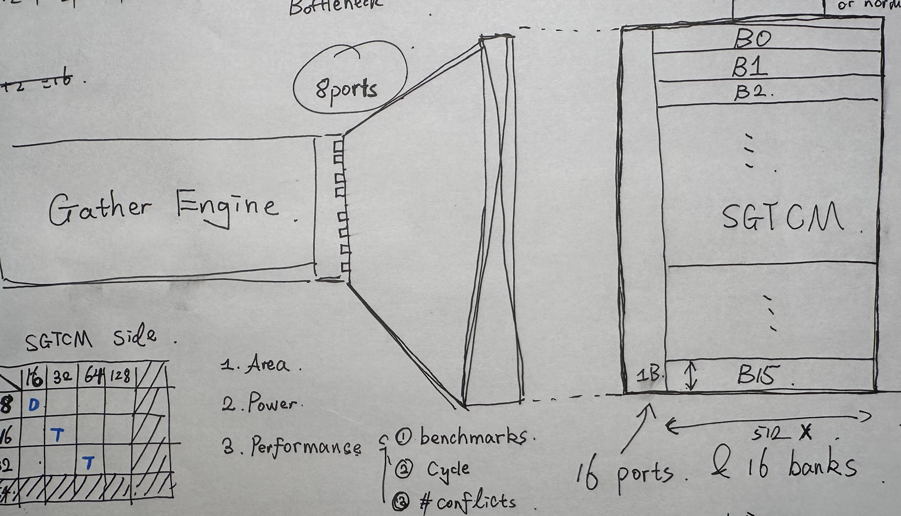

# Report
## How to use current SGTCM in Saturn

Load data to register -> Store them to SGTCM address reagion -> gather

```riscv
li s0, 0x78000000

# Scalar Store initialize SGTCM
li t0, 101
sw t0, 0(s0)
li t0, 102
sw t0, 4(s0)
li t0, 103
sw t0, 8(s0)
li t0, 104
sw t0, 12(s0)

vsetivli zero, 4, e32, m1, ta, ma
la t0, indices
vle32.v v1, (t0)

# Gather
vluxei32.v v2, (s0), v1
```

## How to Evaluate the HW Design
| Work | Performance Platform | Process / PDK | Synthesis | P&R | Power Evaluation | PPA Fidelity |
|---|---|---|---|---|---|---|
| **DX100 (ISCA'25)** | gem5 + Ramulator2 | **[Commercial / Proprietary]** TSMC 28nm; BCAM evaluated using 28nm FDSOI technology data | **[Commercial]** Synopsys Design Compiler | — | **[Commercial toolchain]** Synthesis-based power estimation; exact power tool unspecified | **Post-Synthesis** |
| **Saturn** | RTL simulation | **[Commercial / Proprietary]** Commercial 16nm process; foundry/PDK undisclosed | **[Commercial]** Cadence VLSI tools | **[Commercial]** Cadence VLSI tools; physical layout produced | **[Commercial]** Workload switching activity + post-P&R routing parasitics; exact Cadence power tool unspecified | **Post-P&R** |
| **EARTH** | Intel Stratix 10 GX 10M FPGA @ 20 MHz | **[Commercial / Proprietary]** 3-nm-class PDK with SVT cells; foundry undisclosed | **[Commercial]** Synopsys Design Compiler | — | **[Commercial]** Synopsys SpyGlass using workload switching activity | **Post-Synthesis Estimate** |
| **Ara2** | Cycle-accurate RTL simulation | **[Commercial / Proprietary]** 22nm FD-SOI; foundry/PDK undisclosed in the paper | **[Commercial / Industrial-grade]** Exact tool unspecified | **[Commercial / Industrial-grade]** Exact tool unspecified | **[Commercial / Industrial-grade]** Delay-back-annotated VCD generated from the P&R design; exact tool unspecified | **Post-P&R** |
| **Ara (2020)** | Cycle-accurate RTL simulation | **[Commercial / Proprietary]** GLOBALFOUNDRIES 22FDX FD-SOI | **[Commercial]** Synopsys Design Compiler 2017.09 | **[Commercial]** Cadence Innovus 18.11 | **[Commercial]** Synopsys PrimeTime 2016.12 | **Post-P&R** |

- PDK: Process Design Kit
- Syn: Synthesis
- P&R: Place and Route


## PPA Study Cont.



- EDA Tools: Yosys/ OpenROAD
- PDK: ASAP7

### Entire Chip Area after Syn

| vsgPorts \ SGTCM banks | 16 | 32 | 64 | 128 |
|---:|---:|---:|---:|---:|
| 8 | 252627.178860 | 255071.268000 | 260458.446780 | 270585.860580 |
| 16 | 255871.812060 | 260565.361920 | 270107.155440 | 289816.516080 |
| 32 | 262507.082580 | 271406.320920 | 290807.489520 | 327160.590839 |

- Unit: um²

### Area Overhead of Gather Scatter Fast Path

| vsgPorts \ SGTCM banks | 16 | 32 | 64 | 128 |
|---:|---:|---:|---:|---:|
| 8 | 4135.573260 | 6579.662400 | 11966.841180 | 22094.254980 |
| 16 | 7380.206460 | 12073.756320 | 21615.549840 | 41324.910480 |
| 32 | 14015.476980 | 22914.715320 | 42315.883920 | 78668.985239 |

- Shuttle + Saturn (without fast path): 248491.605600
- Unit: um²

### Normalized Overhead

| vsgPorts \ SGTCM banks | 16 | 32 | 64 | 128 |
|---:|---:|---:|---:|---:|
| 8 | 1.000000 | 1.591000 | 2.893000 | 5.342000 |
| 16 | 1.785000 | 2.920000 | 5.227000 | 9.992000 |
| 32 | 3.389000 | 5.541000 | 10.232000 | 19.022000 |

### Power Data
Current PDK (ASAP7) lacks SRAM power model. I tried Sky130 (in progress).

## Performance of different configuration.

### Entire procedure
```
Reside data in SGTCM
Loop{
    Some Scalar code computes index
    #ROI
    Increament total cycle counter
}
```

### Reagion of Interest
```riscv
vsetvli zero, ra, e8, m1, ta, ma
csrr a3, mcycle	
vle32.v v8, (s3)
vluxei32.v v16, (s2), v8
vse8.v v16, (a4)
fence rw, rw                        // Shuttle will drain the vector pipeline
csrr a5, mcycle
```

### Index Pattern
1. Unit Stride (0, 1, 2 ...)
2. Stride-2 (0, 2, 4, 6 ...)
3. Stride-4 (0, 4, 8, 12 ...)
4. Duplicate (0, 0, 1, 1, 2, 2 ...)
5. All Duplicate (0, 0, 0, 0 ...)

### Test Configurations and Expectation
| vsgPorts \ SGTCM banks | 16 | 32 | 64 | 128 |
|---:|---:|---:|---:|---:|
| 8 | Baseline| Better Stride-4 | Better Stride-4 | - |
| 16 | - | 2x Bandwidth | - | - |
| 32 | - | - | 4x Bandwidth | - |

### Experiment Results
#### VSG8TCM16 — e8

| Pattern | Cycles | Cycles / Elem | SG Bank Conflicts | SG Gather Ops | Δ Cycles vs Unit-stride | Rel. Difference | Conflict Overhead / Conflict |
|---|---:|---:|---:|---:|---:|---:|---:|
| unit-stride | 5,398 | 2.636 | 0 | 64 | 0 | 0.00% | N/A |
| stride-2 | 5,389 | 2.631 | 0 | 64 | -9 | -0.17% | N/A |
| stride-4 | 4,981 | 2.432 | 1,024 | 64 | -417 | -7.73% | -0.407 |
| duplicate | 4,982 | 2.433 | 1,024 | 64 | -416 | -7.71% | -0.406 |
| all-duplicate | 5,928 | 2.895 | 1,792 | 64 | +530 | +9.82% | +0.296 |

#### VSG8TCM16 — e32

| Pattern | Cycles | Cycles / Elem | SG Bank Conflicts | SG Gather Ops | Δ Cycles vs Unit-stride | Rel. Difference | Conflict Overhead / Conflict |
|---|---:|---:|---:|---:|---:|---:|---:|
| unit-stride | 16,534 | 8.073 | 0 | 256 | 0 | 0.00% | N/A |
| stride-2 | 16,532 | 8.072 | 0 | 256 | -2 | -0.01% | N/A |
| stride-4 | 17,554 | 8.571 | 4,096 | 256 | +1,020 | +6.17% | +0.249 |
| duplicate | 16,784 | 8.195 | 4,096 | 256 | +250 | +1.51% | +0.061 |
| all-duplicate | 17,553 | 8.571 | 4,096 | 256 | +1,019 | +6.16% | +0.249 |

#### VSG8TCM16 — e64

| Pattern | Cycles | Cycles / Elem | SG Bank Conflicts | SG Gather Ops | Δ Cycles vs Unit-stride | Rel. Difference | Conflict Overhead / Conflict |
|---|---:|---:|---:|---:|---:|---:|---:|
| unit-stride | 33,088 | 16.156 | 0 | 512 | 0 | 0.00% | N/A |
| stride-2 | 33,064 | 16.145 | 0 | 512 | -24 | -0.07% | N/A |
| stride-4 | 33,079 | 16.152 | 0 | 512 | -9 | -0.03% | N/A |
| duplicate | 33,063 | 16.144 | 0 | 512 | -25 | -0.08% | N/A |
| all-duplicate | 33,063 | 16.144 | 0 | 512 | -25 | -0.08% | N/A |

#### VSG8 — Unit-Stride

| TCM | EEW | Cycles | Cycles / Elem | SG Bank Conflicts | SG Gather Ops |
|---:|---:|---:|---:|---:|---:|
| 16 | e8 | 5,398 | 2.636 | 0 | 64 |
| 16 | e32 | 16,534 | 8.073 | 0 | 256 |
| 16 | e64 | 33,088 | 16.156 | 0 | 512 |
| 32 | e8 | 5,398 | 2.636 | 0 | 64 |
| 32 | e32 | 16,534 | 8.073 | 0 | 256 |
| 32 | e64 | 33,088 | 16.156 | 0 | 512 |
| 64 | e8 | 5,398 | 2.636 | 0 | 64 |
| 64 | e32 | 16,534 | 8.073 | 0 | 256 |
| 64 | e64 | 33,088 | 16.156 | 0 | 512 |

#### VSG8 — Stride-4

| TCM | EEW | Cycles | Cycles / Elem | SG Bank Conflicts | SG Gather Ops |
|---:|---:|---:|---:|---:|---:|
| 16 | e8 | 4,981 | 2.432 | 1,024 | 64 |
| 16 | e32 | 17,554 | 8.571 | 4,096 | 256 |
| 16 | e64 | 33,079 | 16.152 | 0 | 512 |
| 32 | e8 | 4,917 | 2.401 | 0 | 64 |
| 32 | e32 | 16,529 | 8.071 | 0 | 256 |
| 32 | e64 | 33,079 | 16.152 | 0 | 512 |
| 64 | e8 | 4,917 | 2.401 | 0 | 64 |
| 64 | e32 | 16,529 | 8.071 | 0 | 256 |
| 64 | e64 | 33,079 | 16.152 | 0 | 512 |

### e8

| Pattern | VSG8 + TCM16 | VSG16 + TCM32 | Speedup | VSG32 + TCM64 | Speedup |
|---|---:|---:|---:|---:|---:|
| unit-stride | 5,398 | 5,398 | 1.000× | 5,398 | 1.000× |
| stride-2 | 5,389 | 5,389 | 1.000× | 5,389 | 1.000× |
| stride-4 | 4,981 | 4,917 | 1.013× | 4,917 | 1.013× |
| duplicate | 4,982 | 4,982 | 1.000× | 4,982 | 1.000× |
| all-duplicate | 5,928 | 5,928 | 1.000× | 5,928 | 1.000× |

Element/Cycle = min{DLEN/index_width, vsgPorts/data_width_byte}

- index width = 32
- DLEN = 256 bits
- VLEN = 256 bits

- e8 epc = 8 across diferent configurations

### e32

| Pattern | VSG8 + TCM16 | VSG16 + TCM32 | Speedup | VSG32 + TCM64 | Speedup |
|---|---:|---:|---:|---:|---:|
| unit-stride | 16,534 | 16,019 | 1.032× | 15,765 | 1.049× |
| stride-2 | 16,532 | 16,025 | 1.032× | 15,766 | 1.049× |
| stride-4 | 17,554 | 16,529 | 1.062× | 16,019 | 1.096× |
| duplicate | 16,784 | 16,274 | 1.031× | 16,016 | 1.048× |
| all-duplicate | 17,553 | 17,553 | 1.000× | 17,553 | 1.000× |

### e64

| Pattern | VSG8 + TCM16 | VSG16 + TCM32 | Speedup | VSG32 + TCM64 | Speedup |
|---|---:|---:|---:|---:|---:|
| unit-stride | 33,088 | 32,064 | 1.032× | 31,550 | 1.049× |
| stride-2 | 33,064 | 32,040 | 1.032× | 31,531 | 1.049× |
| stride-4 | 33,079 | 33,079 | 1.000× | 32,050 | 1.032× |
| duplicate | 33,063 | 32,568 | 1.015× | 32,042 | 1.032× |
| all-duplicate | 33,063 | 33,063 | 1.000× | 33,063 | 1.000× |